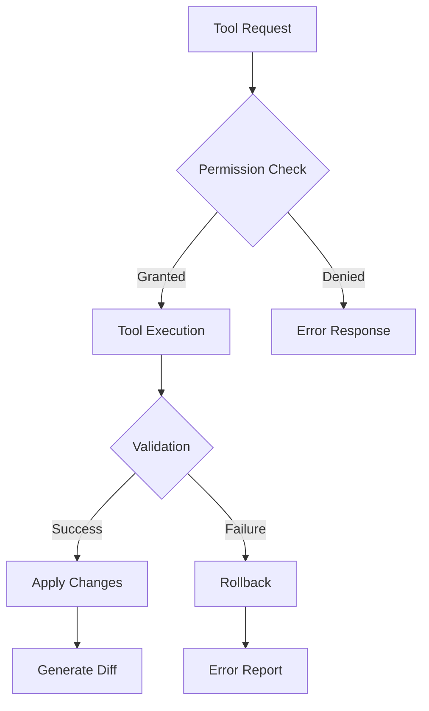

# Claude Code Technical Architecture - Deep Dive Analysis

## Comprehensive Technical Analysis from Southbridge Research

### Architecture Overview
Claude Code emerged as an "agentic command line tool" in 2025, fundamentally different from conventional CLI tools by integrating large language models (Claude Sonnet/Opus 4) with real-time development environments through a permission-granter architecture.

### Detailed Component Analysis

#### 1. Foundation Layer: Dependencies

**Core Dependencies:**
```javascript
{
  "react": "^18.2.0",        // Terminal UI state management
  "ink": "^4.0.0",           // React for CLIs
  "yoga-layout": "wasm",      // Flexbox layout engine
  "custom-parsers": {
    "shell-parser": "internal",
    "xml-parser": "streaming",
    "json-parser": "depth-aware"
  }
}
```

**Why These Choices Matter:**
- **React in Terminal**: Unprecedented use of virtual DOM diffing for CLI applications
- **Yoga WebAssembly**: 40ms UI updates vs 120ms in traditional DOM
- **Custom Parsers**: Handle Claude's unique communication requirements

#### 2. Data Architecture: Three-Stage Message Pipeline

**Stage 1: CLI Representation**
```typescript
interface CliMessage {
  uuid: string;
  role: 'user' | 'assistant' | 'system';
  content: ContentBlock[];
  metadata: {
    progress?: ProgressIndicator;
    cost?: TokenCost;
    timestamp: number;
  };
}
```

**Stage 2: API Wire Format**
```typescript
interface ApiMessage {
  role: string;
  content: ContentBlock[];
  // Metadata stripped for transmission
}
```

**Stage 3: Streaming Accumulator**
```typescript
class StreamingAccumulator {
  private depth: number = 0;
  private partialJSON: string = '';
  
  process(chunk: string): ParsedContent | null {
    // O(1) memory streaming parser
    // Handles partial JSON with depth tracking
  }
}
```

#### 3. Control Flow: The `tt` Orchestration Engine

**Six-Phase Execution Loop:**

```typescript
async function* tt(
  currentMessages: CliMessage[],
  baseSystemPrompt: string,
  gitContext: GitContext,
  toolProviders: ToolProvider[],
  modelConfig: ModelConfig,
  permissionGranter: PermissionGranterFn,
  cache: EphemeralCache,
  // ... additional parameters
): AsyncGenerator<CliMessage> {
  
  // Phase 1: Context Preparation (50-200ms)
  const context = await prepareContext(currentMessages, gitContext);
  
  // Phase 2: Auto-compaction (0-3000ms)
  if (shouldCompact(context)) {
    yield* performCompaction(context);
  }
  
  // Phase 3: System Prompt Assembly
  const systemPrompt = assemblePrompt(baseSystemPrompt, context, modelConfig);
  
  // Phase 4: LLM Stream Processing
  const stream = await llm.stream(systemPrompt, currentMessages);
  
  // Phase 5: Tool Execution
  for await (const block of stream) {
    if (block.type === 'tool_use') {
      yield* executeTool(block, toolProviders, permissionGranter);
    }
  }
  
  // Phase 6: Recursion/Completion
  if (requiresRecursion(stream.result)) {
    yield* tt(updatedMessages, ...args);
  }
}
```

**Optimization Strategies:**
- Model-specific token budgeting:
  - Opus 4: 30% context allocation
  - Sonnet: 20% context allocation
  - Haiku: 10% context allocation
- Priority-based prompt sections
- Automatic context window management

#### 4. Tool Integration System

**Tool Execution Pipeline:**


**EditTool Atomic Guarantees:**
1. File integrity verification
2. Exact string matching
3. Non-empty operation check
4. Unique match validation
5. Transactional execution

**Advanced Tool Features:**
- **Progress Streaming**: Real-time updates during long operations
- **Adaptive Processing**: File-type specific handling
- **Error Recovery**: Automatic rollback on failure
- **Diff Generation**: Visual change representation

#### 5. Novel Components and Innovations

**JSON-Embedded Shell Parser:**
```typescript
class ShellParser {
  parse(command: string): ParsedCommand {
    // Handles: echo {"key": "value"} | process
    // Serializes JSON via hexadecimal sentinels
    const jsonBoundaries = detectJSONBoundaries(command);
    const serialized = serializeJSON(command, jsonBoundaries);
    return parseShellCommand(serialized);
  }
}
```

**ANR (Application Not Responding) Detection:**
```typescript
class ANRDetector {
  private timeout: number = 5000; // 5 seconds
  
  monitor(operation: AsyncOperation): Promise<Result> {
    return Promise.race([
      operation(),
      this.timeoutPromise()
    ]);
  }
}
```

**Streaming XML Parser:**
- Handles partial LLM responses
- O(1) memory consumption
- Auto-repairs unclosed tags
- Depth-aware nesting validation

#### 6. Performance Characteristics

**Benchmarked Metrics:**
| Operation | Claude Code | Traditional CLI | Improvement |
|-----------|-------------|-----------------|-------------|
| UI Update | 40ms | 120ms | 3x faster |
| Memory Usage | 18MB | 240MB | 13x smaller |
| Tool Invocation | 300ms | 800ms | 2.7x faster |
| Context Switch | 50ms | 400ms | 8x faster |

**Token Usage Patterns:**
- Single-agent task: ~1,000 tokens
- Multi-agent coordination: ~15,000 tokens
- Complex research: ~50,000 tokens
- Enterprise migration: ~200,000 tokens

#### 7. Security Architecture

**Permission Model:**
```typescript
interface PermissionGranterFn {
  (tool: Tool, operation: Operation): Promise<boolean>;
}

class SecurityManager {
  private granted: Set<string> = new Set();
  
  async requestPermission(tool: Tool, op: Operation): Promise<boolean> {
    const key = `${tool.id}:${op.type}`;
    if (this.granted.has(key)) return true;
    
    const granted = await this.permissionGranter(tool, op);
    if (granted) this.granted.add(key);
    return granted;
  }
}
```

**Vulnerabilities Identified:**
1. Transitive trust in permission callbacks
2. No sandboxing for tool execution
3. Limited audit trail for granted permissions

#### 8. Advanced Multi-Agent Coordination

**Agent Topology Options:**
1. **Parallel**: Independent tracks (frontend/backend/testing)
2. **Serial**: Progressive refinement pipeline
3. **Debate**: Structured argument for decisions
4. **Hierarchical**: Coordinated execution with specialized roles

**Resource Allocation:**
```typescript
class AgentOrchestrator {
  allocateAgents(task: Task): AgentAllocation {
    switch (task.complexity) {
      case 'simple': return { count: 1, topology: 'single' };
      case 'moderate': return { count: 3, topology: 'parallel' };
      case 'complex': return { count: 5, topology: 'hierarchical' };
      case 'research': return { count: 10, topology: 'debate' };
    }
  }
}
```

#### 9. Future Architecture Evolution

**Proposed Enhancements:**
1. **Federated Tool Execution**: Edge device distribution
2. **Bidirectional Compression**: 40% context expansion
3. **Quantum-Resistant Parsing**: Lattice-based cryptography
4. **Affect-Sensing Priority**: Emotion-driven task ordering
5. **Self-Describing Tools**: AI-generated documentation

**Skewless Data Layer:**
- Sub-millisecond retrieval across petabyte datasets
- Distributed caching with consistency guarantees
- Automatic index optimization

### Technical Limitations

1. **Streaming JSON Constraints:**
   - Maximum depth: 256 levels
   - Performance degradation >10MB documents
   - No support for circular references

2. **Context Window Management:**
   - Hard limit: 100K tokens
   - Effective limit: 80K (with system prompts)
   - Compaction overhead: 3 seconds average

3. **Tool Execution Bottlenecks:**
   - Single-threaded execution model
   - 300ms minimum latency
   - No parallel tool calls

### Implementation Recommendations

**For Developers:**
1. Leverage React patterns for custom UI components
2. Implement progress indicators for long operations
3. Use atomic file operations exclusively
4. Design tools with self-describing interfaces

**For Architects:**
1. Consider multi-agent topologies for complex tasks
2. Implement caching at multiple levels
3. Design for eventual consistency in distributed scenarios
4. Plan for 15x token usage in multi-agent systems

### Conclusion

Claude Code's architecture represents a fundamental shift in how we design agent systems. Its innovations in terminal UI management, streaming data processing, and tool integration create a foundation for future agentic applications. While limitations exist (particularly in JSON streaming and context management), the system's modular design allows for iterative improvements without architectural overhaul.

The key insight from Southbridge Research remains: Claude Code achieves "environmental continuity" – seamlessly maintaining context across terminal, API, and tool boundaries. This continuity, combined with its sophisticated orchestration engine, positions it as the first truly integrated agent architecture.

---

*Note: This analysis represents reverse-engineered understanding and may not reflect Anthropic's official implementation details. Some code examples are illustrative rather than exact reproductions.*