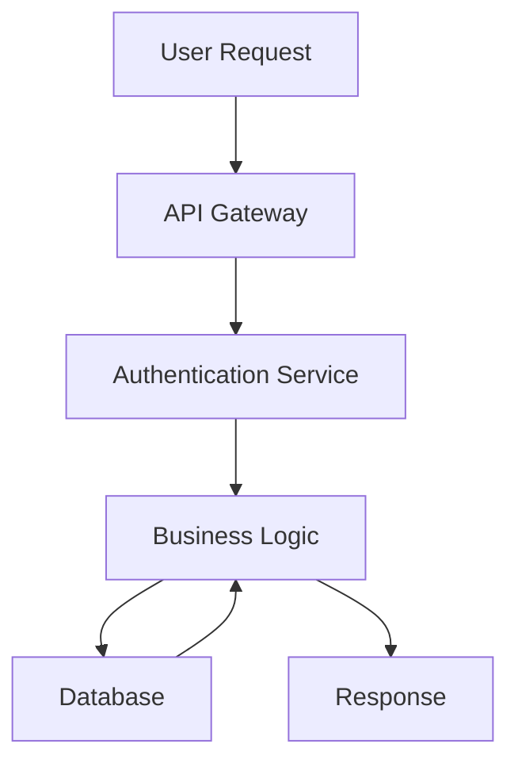

# Workflow-Specific Plugin Configurations

## 📚 Research & Literature Review Workflow

### Core Plugins for Literature Management

#### Citations Plugin
**Plugin ID**: `obsidian-citation-plugin`
**Purpose**: Academic citation management

**Configuration**:
```json
{
  "citationFormat": "[[@{{citekey}}]]",
  "bibliographyPaths": ["00-System/references.bib"],
  "markdownCitationFormat": "[@{{citekey}}]",
  "alternativeMarkdownCitationFormat": "[[@{{citekey}}]]"
}
```

**Research Applications**:
- Import citations from Zotero/Mendeley
- Auto-generate bibliographies
- Link citations to literature notes
- Track citation usage across vault

#### Better Word Count
**Plugin ID**: `better-word-count`
**Purpose**: Advanced writing statistics

**Research Applications**:
- Track writing progress on papers
- Monitor literature review length
- Set writing goals for research documents
- Character count for abstracts

### Literature Review Template Integration

```javascript
// QuickAdd Macro: New Literature Review
function createLiteratureReview() {
  const title = await this.quickAddApi.inputPrompt("Paper title:");
  const author = await this.quickAddApi.inputPrompt("Author(s):");
  const year = await this.quickAddApi.inputPrompt("Publication year:");
  const topic = await this.quickAddApi.suggester(["AI", "Software Dev", "Business"], ["ai", "dev", "business"]);
  
  const fileName = `${year}-${author.split(' ')[0]}-${title.replace(/\s+/g, '-')}`;
  
  await this.quickAddApi.createNoteFromTemplate(
    "Literature Review Template",
    `01-AI-and-LLMs/literature-reviews/${fileName}`
  );
}
```

## 🛠️ Software Development Workflow

### Code-Focused Plugins

#### Advanced URI
**Plugin ID**: `obsidian-advanced-uri`
**Purpose**: Deep linking and automation

**Development Applications**:
- Link to specific code sections
- Create development task automation
- Integration with external tools
- Jump to related documentation

#### Code Block Copy
**Plugin ID**: `obsidian-code-block-copy`
**Purpose**: One-click code copying

**Configuration**:
```json
{
  "showCopyButton": true,
  "copyButtonPosition": "top-right",
  "showLanguageLabel": true,
  "excludeLanguages": ["mermaid", "dataview"]
}
```

#### Mermaid
**Plugin ID**: Built-in (enable in Core Plugins)
**Purpose**: Diagram creation

**Development Applications**:
- System architecture diagrams
- API flow charts
- Database schemas
- Process documentation

**Example Diagrams**:


### Development Note Templates

#### API Documentation Template
```markdown
---
title: {{title}}
api_version: 
endpoint: 
method: 
tags: [#api, #documentation, #{{project}}]
status: draft
---

# {{title}}

## Endpoint
**URL**: `{{endpoint}}`
**Method**: `{{method}}`
**Version**: `{{api_version}}`

## Description

## Parameters
| Parameter | Type | Required | Description |
|-----------|------|----------|-------------|
|           |      |          |             |

## Request Example
```json
{
  
}
```

## Response Example
```json
{
  
}
```

## Error Codes
| Code | Description |
|------|-------------|
|      |             |

## Related Endpoints
- [[]]

## Testing Notes

## Change Log
```

#### Code Review Template
```markdown
---
title: Code Review - {{title}}
date: {{date}}
reviewer: 
author: 
branch: 
status: pending
tags: [#code-review, #{{project}}]
---

# Code Review: {{title}}

## Overview
**Branch**: `{{branch}}`
**Author**: {{author}}
**Reviewer**: {{reviewer}}
**Date**: {{date}}

## Files Changed
- [ ] `file1.js`
- [ ] `file2.py`

## Review Checklist
- [ ] Code follows style guidelines
- [ ] Tests are included and passing
- [ ] Documentation is updated
- [ ] No security vulnerabilities
- [ ] Performance considerations addressed

## Comments
### file1.js
- Line 42: Consider using const instead of let
- Line 87: Add error handling

## Recommendations

## Approval Status
- [ ] Approved
- [ ] Needs Changes
- [ ] Rejected

## Follow-up Actions
```

## 📊 Business Analysis Workflow

### Analysis-Focused Plugins

#### Table Generator
**Plugin ID**: `table-generator`
**Purpose**: Quick table creation

**Business Applications**:
- Requirements matrices
- Stakeholder analysis tables
- Risk assessment grids
- Feature comparison charts

#### Charts View
**Plugin ID**: `obsidian-charts`
**Purpose**: Data visualization

**Configuration Example**:
```javascript
```chart
type: bar
labels: [Q1, Q2, Q3, Q4]
series:
  - title: Revenue
    data: [100, 120, 140, 160]
  - title: Costs
    data: [80, 90, 100, 110]
```

#### Database Folder
**Plugin ID**: `dbfolder`
**Purpose**: Database-like note management

**Business Applications**:
- Stakeholder database
- Requirements tracking
- Issue management
- Project portfolio view

### Business Analysis Templates

#### Requirements Document Template
```markdown
---
title: {{title}}
project: 
stakeholder: 
priority: 
status: draft
tags: [#requirements, #{{project}}]
---

# {{title}}

## Requirement ID
REQ-{{project}}-{{number}}

## Description

## Acceptance Criteria
- [ ] Criterion 1
- [ ] Criterion 2
- [ ] Criterion 3

## Business Justification

## Stakeholders
- **Primary**: 
- **Secondary**: 

## Dependencies
- [[REQ-{{project}}-{{dependency}}]]

## Risks
| Risk | Impact | Mitigation |
|------|--------|------------|
|      |        |            |

## Testing Approach

## Related Requirements

## Change History
```

#### Stakeholder Analysis Template
```markdown
---
title: Stakeholder Analysis - {{project}}
date: {{date}}
project: {{project}}
tags: [#stakeholder-analysis, #{{project}}]
---

# Stakeholder Analysis: {{project}}

## Stakeholder Matrix

| Name | Role | Influence | Interest | Engagement Strategy |
|------|------|-----------|----------|-----------------|
|      |      | High/Med/Low | High/Med/Low | |

## Primary Stakeholders
### {{stakeholder_name}}
- **Role**: 
- **Influence**: High/Medium/Low
- **Interest**: High/Medium/Low
- **Communication Preference**: 
- **Key Concerns**: 
- **Engagement Strategy**: 

## Communication Plan
| Stakeholder | Frequency | Method | Content |
|-------------|-----------|--------|----------|
|             |           |        |         |

## Risk Assessment
| Stakeholder | Risk | Impact | Mitigation |
|-------------|------|--------|------------|
|             |      |        |            |
```

## 🔄 Cross-Workflow Automation

### QuickAdd Macros for All Workflows

#### Universal Research Capture
```javascript
module.exports = async function(params) {
  const { quickAddApi: { inputPrompt, suggester } } = params;
  
  const type = await suggester(
    ["Research Note", "Literature Review", "Code Review", "Requirements"],
    ["research", "literature", "code", "requirements"]
  );
  
  const title = await inputPrompt("Title:");
  const project = await suggester(
    ["AI/LLMs", "Software Dev", "Business Analysis", "API Documentation"],
    ["01-AI-and-LLMs", "02-Software-Development", "03-Business-Analysis", "04-API-Documentation"]
  );
  
  const templates = {
    research: "Research Note",
    literature: "Literature Review",
    code: "Code Review",
    requirements: "Requirements Document"
  };
  
  const folders = {
    research: `${project}/research`,
    literature: `${project}/literature-reviews`,
    code: `${project}/code-reviews`,
    requirements: `${project}/requirements`
  };
  
  await this.app.fileManager.createNewMarkdownFile(
    this.app.vault.getAbstractFileByPath(folders[type]),
    title,
    templates[type]
  );
};
```

### Templater Global Functions

Add to Templater settings → User Script Functions:

```javascript
// Generate unique ID
function generateId() {
  return Date.now().toString(36) + Math.random().toString(36).substr(2);
}

// Get current project from folder
function getCurrentProject() {
  const currentFile = this.app.workspace.getActiveFile();
  if (!currentFile) return "Unknown";
  
  const path = currentFile.path;
  const parts = path.split('/');
  return parts[0] || "Unknown";
}

// Auto-tag based on folder
function getAutoTags() {
  const project = getCurrentProject();
  const tagMap = {
    "01-AI-and-LLMs": ["#ai", "#research"],
    "02-Software-Development": ["#development", "#coding"],
    "03-Business-Analysis": ["#business", "#analysis"],
    "04-API-Documentation": ["#api", "#documentation"]
  };
  
  return tagMap[project] || ["#general"];
}
```

## 📅 Maintenance & Optimization

### Plugin Update Schedule
- **Weekly**: Check for critical plugin updates
- **Monthly**: Review plugin performance and usage
- **Quarterly**: Evaluate new plugins and remove unused ones

### Performance Monitoring
- Use "Show debug info" in Developer settings
- Monitor startup time and memory usage
- Disable plugins during intensive work sessions

### Backup Strategy
- Git plugin for daily automated backups
- Weekly manual export of settings
- Monthly full vault archive

---

*This configuration guide is optimized for research workflows involving AI, software development, and business analysis.*