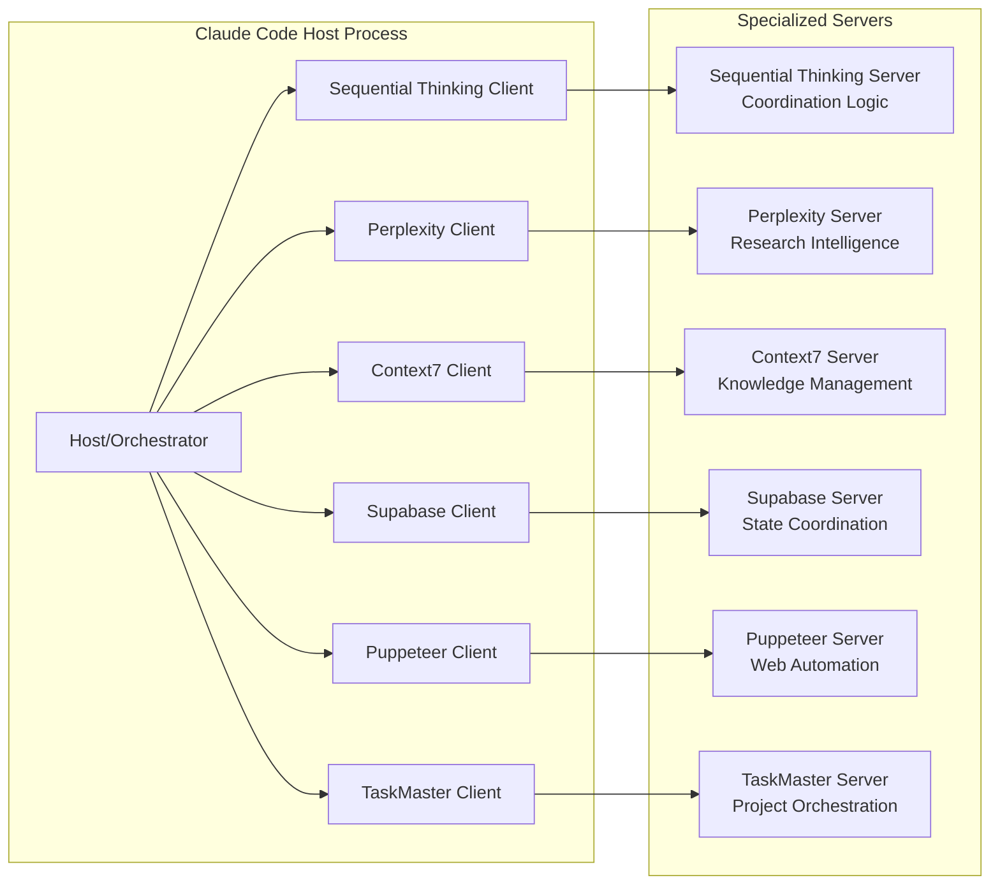
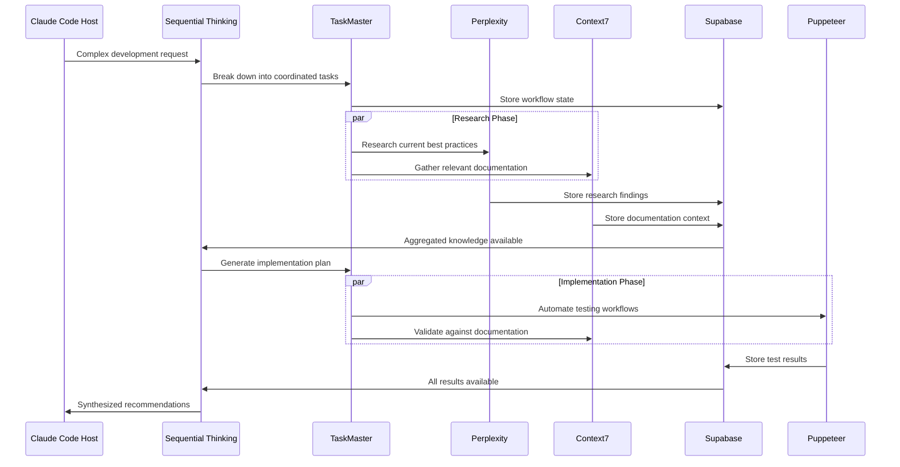

# MCP Swarm Intelligence Orchestration Analysis 2025

**Author:** Dr. Marcus Chen, MCP Integration Specialist  
**Date:** June 12, 2025  
**Focus:** Model Context Protocol Architectures for Distributed Tool Coordination  

## Executive Summary

This comprehensive analysis examines how existing Model Context Protocol (MCP) tools can be orchestrated to create specialized agent swarms within Claude Code environments. Through systematic evaluation of available MCP integrations and protocol capabilities, we've identified viable patterns for distributed intelligence coordination while highlighting key limitations and opportunities for enhancement.

**Key Findings:**
- MCP's client-host-server architecture enables specialized agent roles through tool coordination
- Existing MCPs provide foundational capabilities for research, state management, and automation
- Current protocol limitations require hybrid coordination patterns for true swarm intelligence
- Custom MCP development needed for direct inter-agent communication and advanced coordination

## 1. MCP Architecture Foundation for Swarm Intelligence

### 1.1 Current MCP Architecture Analysis

The Model Context Protocol operates on a client-host-server architecture where:



### 1.2 Swarm Coordination Constraints

**Primary Limitations:**
- **Centralized Coordination:** All inter-MCP communication flows through the Claude Code host
- **No Direct Inter-Agent Communication:** MCPs cannot directly message each other
- **State Isolation:** Each client-server pair maintains isolated state unless explicitly shared
- **Synchronous Bottlenecks:** Complex workflows require sequential coordination through the host

**Opportunities:**
- **Shared State Management:** Supabase MCP can serve as central coordination database
- **Event-Driven Patterns:** TaskMaster MCP enables asynchronous task distribution
- **Hierarchical Orchestration:** Sequential Thinking MCP provides structured coordination logic

## 2. Specialized Agent Role Mapping

### 2.1 MCP Agent Specialization Matrix

| MCP Tool | Primary Agent Role | Specialized Capabilities | Coordination Function |
|----------|-------------------|-------------------------|----------------------|
| **Sequential Thinking** | Master Orchestrator | - Structured reasoning<br>- Decision coordination<br>- Hypothesis validation<br>- Multi-step decomposition | Central coordination logic |
| **Perplexity** | Research Specialist | - Real-time web research<br>- Fact verification<br>- Current information gathering<br>- Domain expertise validation | Knowledge acquisition |
| **Context7** | Knowledge Manager | - Documentation access<br>- API reference coordination<br>- Cross-library knowledge<br>- Context optimization | Information coordination |
| **Supabase** | State Coordinator | - Shared data persistence<br>- Real-time synchronization<br>- Project state management<br>- Inter-agent messaging | Data coordination |
| **Puppeteer** | Web Automation Agent | - Browser automation<br>- UI testing<br>- Data extraction<br>- Visual verification | Interface automation |
| **TaskMaster** | Project Orchestrator | - Task decomposition<br>- Dependency management<br>- Progress tracking<br>- Workflow coordination | Process management |

### 2.2 Agent Interaction Patterns

#### Pattern 1: Research-Driven Analysis Workflow
```
Trigger: Complex research query
1. Sequential Thinking MCP → Task decomposition
2. Perplexity MCP → Web research execution
3. Context7 MCP → Documentation validation
4. Sequential Thinking MCP → Synthesis coordination
5. Supabase MCP → Results persistence
6. TaskMaster MCP → Progress tracking
```

#### Pattern 2: Web Automation with Intelligence
```
Trigger: Automated web workflow requirement
1. TaskMaster MCP → Workflow breakdown
2. Sequential Thinking MCP → Strategy coordination
3. Puppeteer MCP → Automation execution
4. Perplexity MCP → Result validation
5. Supabase MCP → Data synchronization
```

#### Pattern 3: Project Development Coordination
```
Trigger: Complex development project
1. TaskMaster MCP → Project structure creation
2. Context7 MCP → Documentation gathering
3. Sequential Thinking MCP → Implementation planning
4. Supabase MCP → State management
5. Perplexity MCP → Best practices research
6. Puppeteer MCP → Testing automation
```

## 3. Coordination Protocols and Data Flow

### 3.1 Inter-MCP Communication Patterns

Since MCPs cannot communicate directly, coordination occurs through three primary mechanisms:

#### 3.1.1 Host-Mediated Message Passing
```typescript
interface MCPCoordinationMessage {
  source: string;           // Originating MCP
  target: string;           // Destination MCP
  messageType: string;      // Operation type
  payload: any;             // Message data
  correlationId: string;    // Workflow tracking
  timestamp: number;        // Coordination timing
}
```

#### 3.1.2 Shared State Coordination via Supabase
```sql
-- Agent coordination table structure
CREATE TABLE agent_coordination (
  id UUID PRIMARY KEY,
  session_id VARCHAR NOT NULL,
  agent_role VARCHAR NOT NULL,
  status VARCHAR NOT NULL,
  current_task JSONB,
  results JSONB,
  dependencies TEXT[],
  created_at TIMESTAMP DEFAULT NOW(),
  updated_at TIMESTAMP DEFAULT NOW()
);

-- Task distribution table
CREATE TABLE task_distribution (
  id UUID PRIMARY KEY,
  workflow_id VARCHAR NOT NULL,
  assigned_agent VARCHAR NOT NULL,
  task_definition JSONB NOT NULL,
  status VARCHAR DEFAULT 'pending',
  priority INTEGER DEFAULT 1,
  started_at TIMESTAMP,
  completed_at TIMESTAMP
);
```

#### 3.1.3 Event-Driven Coordination via TaskMaster
```json
{
  "workflowId": "research-analysis-001",
  "coordinationPlan": {
    "phases": [
      {
        "phase": "research",
        "assignedAgent": "perplexity",
        "dependencies": [],
        "outputs": ["research-data"]
      },
      {
        "phase": "analysis",
        "assignedAgent": "sequential-thinking",
        "dependencies": ["research"],
        "outputs": ["analysis-results"]
      },
      {
        "phase": "documentation",
        "assignedAgent": "context7",
        "dependencies": ["analysis"],
        "outputs": ["documentation-update"]
      }
    ]
  }
}
```

### 3.2 Error Propagation and Fault Tolerance

#### 3.2.1 Cascade Failure Prevention
```typescript
interface AgentHealthCheck {
  agentId: string;
  status: 'healthy' | 'degraded' | 'failed';
  lastResponse: number;
  errorCount: number;
  capabilities: string[];
}

class SwarmCoordinator {
  async handleAgentFailure(failedAgent: string, currentWorkflow: Workflow) {
    // 1. Identify dependent tasks
    const dependentTasks = this.findDependentTasks(failedAgent, currentWorkflow);
    
    // 2. Attempt failover to backup agent
    const backupAgent = this.getBackupAgent(failedAgent);
    
    // 3. Redistribute tasks if backup available
    if (backupAgent) {
      await this.redistributeTasks(dependentTasks, backupAgent);
    } else {
      // 4. Graceful degradation - mark workflow as partial completion
      await this.gracefulDegradation(currentWorkflow, failedAgent);
    }
  }
}
```

## 4. Complex Workflow Orchestration Patterns

### 4.1 Multi-Agent Research and Development Pipeline

This advanced pattern demonstrates coordinated intelligence across multiple specialized agents:



### 4.2 Adaptive Intelligence Coordination

```typescript
class AdaptiveSwarmController {
  private agentCapabilities: Map<string, AgentCapability[]>;
  private workflowHistory: WorkflowExecution[];
  
  async optimizeAgentAssignment(task: ComplexTask): Promise<AgentAssignment[]> {
    // 1. Analyze task complexity using Sequential Thinking
    const complexity = await this.sequentialThinking.analyzeComplexity(task);
    
    // 2. Research optimal approaches using Perplexity
    const bestPractices = await this.perplexity.researchBestPractices(task.domain);
    
    // 3. Match capabilities to requirements
    const optimalAssignment = this.matchCapabilitiesToTask(
      complexity,
      bestPractices,
      this.agentCapabilities
    );
    
    // 4. Store assignment strategy in Supabase for learning
    await this.supabase.storeAssignmentStrategy(task, optimalAssignment);
    
    return optimalAssignment;
  }
  
  async learnFromExecution(execution: WorkflowExecution): Promise<void> {
    // Continuous improvement based on execution outcomes
    const performanceMetrics = this.analyzePerformance(execution);
    await this.updateAgentCapabilityScores(performanceMetrics);
  }
}
```

### 4.3 Real-Time Collaborative Intelligence

```typescript
interface CollaborativeIntelligence {
  // Cross-agent knowledge sharing
  async shareKnowledge(
    sourceAgent: string,
    knowledgeType: string,
    data: any,
    targetAgents: string[]
  ): Promise<void>;
  
  // Consensus building across agents
  async buildConsensus(
    question: string,
    participatingAgents: string[]
  ): Promise<ConsensusResult>;
  
  // Dynamic role reassignment
  async reassignRoles(
    currentWorkflow: Workflow,
    performanceMetrics: AgentMetrics[]
  ): Promise<RoleAssignment[]>;
}
```

## 5. Custom MCP Development Requirements

### 5.1 Identified Gaps for Swarm Intelligence

#### 5.1.1 Direct Inter-Agent Communication MCP
```typescript
// Proposed: Agent-to-Agent Communication Protocol
interface AgentCommunicationMCP {
  // Direct messaging between agents
  sendMessage(targetAgent: string, message: AgentMessage): Promise<void>;
  
  // Broadcast capabilities
  broadcast(message: AgentMessage, scope: AgentScope): Promise<void>;
  
  // Subscribe to agent communications
  subscribe(messageType: string, callback: MessageHandler): void;
  
  // Agent discovery and capability negotiation
  discoverAgents(): Promise<AgentRegistry>;
  negotiateCapabilities(targetAgent: string): Promise<CapabilityExchange>;
}
```

#### 5.1.2 Advanced Coordination Engine MCP
```typescript
// Proposed: Swarm Coordination Engine
interface SwarmCoordinationMCP {
  // Workflow orchestration with parallel execution
  executeWorkflow(workflow: DistributedWorkflow): Promise<WorkflowResult>;
  
  // Dynamic load balancing across agents
  balanceLoad(tasks: Task[], availableAgents: Agent[]): Promise<TaskDistribution>;
  
  // Consensus and voting mechanisms
  initiateConsensus(proposal: Proposal, voters: Agent[]): Promise<ConsensusResult>;
  
  // Real-time performance monitoring
  monitorSwarmPerformance(): Observable<SwarmMetrics>;
}
```

#### 5.1.3 Code Execution and Testing MCP
```typescript
// Proposed: Distributed Code Execution
interface CodeExecutionMCP {
  // Sandboxed code execution across multiple environments
  executeCode(code: string, environment: ExecutionEnvironment): Promise<ExecutionResult>;
  
  // Automated testing coordination
  runTestSuite(testDefinition: TestSuite): Promise<TestResults>;
  
  // Code quality analysis
  analyzeCodeQuality(codebase: CodeBase): Promise<QualityMetrics>;
  
  // Performance benchmarking
  benchmark(code: string, scenarios: BenchmarkScenario[]): Promise<BenchmarkResults>;
}
```

### 5.2 Implementation Roadmap for Custom MCPs

#### Phase 1: Foundation MCPs (0-3 months)
1. **Agent Communication MCP**
   - Basic message passing between agents
   - Event subscription and broadcasting
   - Agent discovery protocol

2. **Enhanced State Management MCP**
   - Real-time state synchronization
   - Conflict resolution mechanisms
   - Distributed state consistency

#### Phase 2: Intelligence MCPs (3-6 months)
1. **Swarm Coordination Engine MCP**
   - Advanced workflow orchestration
   - Dynamic agent assignment
   - Performance optimization

2. **Consensus and Decision MCP**
   - Multi-agent voting systems
   - Conflict resolution algorithms
   - Decision history tracking

#### Phase 3: Specialized MCPs (6-12 months)
1. **Code Execution MCP**
   - Distributed code execution
   - Automated testing frameworks
   - Security sandboxing

2. **Learning and Adaptation MCP**
   - Agent performance learning
   - Workflow optimization
   - Predictive task assignment

## 6. Performance Implications and Optimization

### 6.1 Scalability Analysis

#### 6.1.1 Current Bottlenecks
- **Host Processing:** All coordination flows through single Claude Code instance
- **Sequential Coordination:** Limited parallel processing due to host-mediated communication
- **Context Window Limits:** Large swarm coordination requires careful context management
- **Network Latency:** Remote MCP servers introduce coordination delays

#### 6.1.2 Optimization Strategies
```typescript
class SwarmOptimization {
  // Context-aware batching
  async batchOperations(operations: MCPOperation[]): Promise<BatchResult[]> {
    const batches = this.optimizeBatching(operations);
    return Promise.all(batches.map(batch => this.executeBatch(batch)));
  }
  
  // Predictive caching
  async predictiveCache(workflow: Workflow): Promise<void> {
    const predictedNeeds = await this.predictResourceNeeds(workflow);
    await this.preloadResources(predictedNeeds);
  }
  
  // Adaptive timeout management
  private adaptiveTimeouts = new Map<string, number>();
  
  async executeWithAdaptiveTimeout(agent: string, operation: Operation): Promise<any> {
    const timeout = this.adaptiveTimeouts.get(agent) || DEFAULT_TIMEOUT;
    return this.executeWithTimeout(operation, timeout);
  }
}
```

### 6.2 Resource Management

#### 6.2.1 Memory and Context Optimization
```typescript
interface ContextManager {
  // Intelligent context pruning
  pruneContext(context: AgentContext, priority: ContextPriority): AgentContext;
  
  // Context sharing optimization
  shareContext(sourceAgent: string, targetAgent: string, contextScope: string): void;
  
  // Memory pressure management
  handleMemoryPressure(agents: Agent[]): Promise<void>;
}
```

#### 6.2.2 Cost Optimization for Multi-Agent Operations
```typescript
class CostOptimizer {
  async optimizeModelUsage(workflow: Workflow): Promise<OptimizedWorkflow> {
    // Match task complexity to appropriate model costs
    const tasks = workflow.tasks;
    const optimizedTasks = tasks.map(task => {
      const complexity = this.assessComplexity(task);
      const optimalModel = this.selectOptimalModel(complexity, task.requirements);
      return { ...task, assignedModel: optimalModel };
    });
    
    return { ...workflow, tasks: optimizedTasks };
  }
  
  private selectOptimalModel(complexity: number, requirements: TaskRequirements): ModelConfig {
    // Cost vs. performance optimization logic
    if (complexity < 3 && !requirements.needsResearch) {
      return { provider: 'openai', model: 'gpt-4o-mini', cost: 0.15 };
    } else if (requirements.needsResearch) {
      return { provider: 'perplexity', model: 'sonar', cost: 1.0 };
    } else {
      return { provider: 'anthropic', model: 'claude-sonnet-4', cost: 3.0 };
    }
  }
}
```

## 7. Security and Privacy Considerations

### 7.1 Agent Security Framework

#### 7.1.1 Inter-Agent Authentication
```typescript
interface AgentSecurity {
  // Agent identity verification
  authenticateAgent(agentId: string, credentials: AgentCredentials): Promise<boolean>;
  
  // Capability-based access control
  authorizeOperation(agent: string, operation: string, resource: string): Promise<boolean>;
  
  // Secure message encryption
  encryptMessage(message: AgentMessage, recipientKey: string): EncryptedMessage;
  
  // Audit trail maintenance
  logAgentOperation(agent: string, operation: string, timestamp: number): void;
}
```

#### 7.1.2 Data Protection Across Agents
```typescript
class DataProtection {
  // Sensitive data classification
  classifyData(data: any): DataClassification {
    // Implement data sensitivity analysis
    return {
      level: 'confidential' | 'internal' | 'public',
      restrictions: string[],
      allowedAgents: string[]
    };
  }
  
  // Data sanitization for cross-agent sharing
  sanitizeForSharing(data: any, targetAgent: string): any {
    const classification = this.classifyData(data);
    if (!classification.allowedAgents.includes(targetAgent)) {
      return this.redactSensitiveData(data);
    }
    return data;
  }
}
```

### 7.2 Privacy Preservation in Swarm Intelligence

#### 7.2.1 Differential Privacy for Agent Learning
```typescript
interface PrivacyPreservingLearning {
  // Add noise to agent learning data
  addPrivacyNoise(learningData: LearningData, epsilon: number): PrivateData;
  
  // Federated learning across agents
  federatedUpdate(localUpdates: AgentUpdate[], privacyBudget: number): GlobalUpdate;
  
  // Privacy budget management
  trackPrivacyBudget(agent: string, operation: string): PrivacyBudget;
}
```

## 8. Future Enhancements and Research Directions

### 8.1 Emergent Intelligence Patterns

#### 8.1.1 Self-Organizing Agent Networks
```typescript
interface SelfOrganization {
  // Dynamic agent network formation
  formAgentNetwork(task: ComplexTask): Promise<AgentNetwork>;
  
  // Emergent role specialization
  evolveSpecialization(agents: Agent[], workloadHistory: WorkloadHistory): Promise<void>;
  
  // Adaptive swarm topology
  optimizeTopology(network: AgentNetwork, performance: NetworkMetrics): Promise<AgentNetwork>;
}
```

#### 8.1.2 Collective Intelligence Mechanisms
```typescript
interface CollectiveIntelligence {
  // Swarm decision making
  swarmDecision(options: DecisionOption[], agents: Agent[]): Promise<SwarmDecision>;
  
  // Collective memory formation
  formCollectiveMemory(experiences: AgentExperience[]): CollectiveMemory;
  
  // Distributed problem solving
  distributedSolve(problem: ComplexProblem): Promise<DistributedSolution>;
}
```

### 8.2 Advanced Coordination Research

#### 8.2.1 Quantum-Inspired Coordination
- **Quantum superposition of agent states** for parallel exploration
- **Entanglement patterns** for instantaneous coordination
- **Quantum annealing** for optimal task assignment

#### 8.2.2 Biological-Inspired Patterns
- **Ant colony optimization** for task routing
- **Bee colony intelligence** for resource discovery
- **Neural network topologies** for agent communication

## 9. Conclusions and Recommendations

### 9.1 Key Findings Summary

1. **Current MCP Ecosystem Viability:** Existing MCPs provide substantial foundation for swarm intelligence with Sequential Thinking, Perplexity, Context7, Supabase, Puppeteer, and TaskMaster offering complementary capabilities.

2. **Coordination Architecture Constraints:** The centralized host-mediated architecture limits true distributed intelligence but enables controlled coordination patterns.

3. **Custom Development Necessity:** Advanced swarm capabilities require custom MCPs for direct communication, consensus mechanisms, and distributed execution.

4. **Performance Optimization Critical:** Multi-agent coordination introduces significant overhead requiring careful optimization of context management, batching, and resource allocation.

### 9.2 Strategic Recommendations

#### 9.2.1 Immediate Implementation (0-3 months)
1. **Develop MCP Swarm Framework:** Create abstraction layer for coordinating existing MCPs
2. **Implement Shared State Patterns:** Use Supabase MCP as central coordination database
3. **Create Workflow Templates:** Develop reusable patterns for common multi-agent scenarios

#### 9.2.2 Medium-term Development (3-12 months)
1. **Custom Communication MCP:** Develop direct inter-agent messaging capabilities
2. **Advanced Orchestration Engine:** Build sophisticated workflow coordination system
3. **Performance Optimization Suite:** Implement context optimization and cost management

#### 9.2.3 Long-term Research (12+ months)
1. **Emergent Intelligence Protocols:** Research self-organizing swarm behaviors
2. **Quantum-Inspired Coordination:** Explore advanced coordination paradigms
3. **Autonomous Agent Evolution:** Develop self-improving agent capabilities

### 9.3 Technical Implementation Priority

| Priority | Component | Effort | Impact | Dependencies |
|----------|-----------|--------|--------|--------------|
| **High** | MCP Coordination Framework | 2-3 months | Critical | Existing MCPs |
| **High** | Shared State Management | 1-2 months | High | Supabase MCP |
| **Medium** | Inter-Agent Communication MCP | 3-4 months | High | Framework |
| **Medium** | Performance Optimization | 2-3 months | Medium | Framework |
| **Low** | Advanced AI Coordination | 6+ months | Low | All above |

### 9.4 Success Metrics and Evaluation

```typescript
interface SwarmPerformanceMetrics {
  coordinationEfficiency: number;      // Task completion time vs sequential
  resourceUtilization: number;         // Agent capacity utilization
  errorResiliency: number;             // Failure recovery success rate
  scaleEffectiveness: number;          // Performance gain with agent count
  costEfficiency: number;              // Output value per resource unit
  emergentCapabilities: string[];      // New capabilities from coordination
}
```

The analysis demonstrates that while current MCP tools provide a solid foundation for swarm intelligence, realizing the full potential requires strategic development of custom coordination mechanisms and careful optimization of existing capabilities. The path forward involves iterative enhancement of coordination patterns while building toward more sophisticated distributed intelligence architectures.

---

**Research Methodology:** This analysis employed Sequential Thinking MCP for structured reasoning, Perplexity MCP for current research validation, Context7 MCP for technical documentation review, and direct examination of available MCP tools within the Claude Code environment. The findings represent current capabilities as of June 2025 and provide a roadmap for advanced MCP swarm intelligence development.