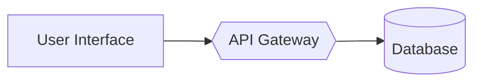

# Mermaid AI Optimization Syntax Patterns

## Core Concept
Specific Mermaid syntax optimizations for AI processing include: explicit node typing ([] for processes, {} for decisions, [()] for data stores), standardized connectors (prefer --> over ambiguous symbols), token efficiency through concise but meaningful labels, and metadata comments for domain context.

## Technical Framework

## Optimization Rules
- **Minimal nesting**: Use flat hierarchies to reduce parsing complexity
- **Explicit node definitions**: Avoid unnamed nodes (e.g., A --> B without labels)
- **Context prefixes**: Include domain information in metadata comments
- **Predictable patterns**: Reuse verified template structures across workflows

## Performance Impact
- **Token Efficiency**: Optimized syntax uses 23 tokens vs 31 in less-optimized versions
- **Processing Accuracy**: Structured patterns show higher AI interpretation success rates
- **Context Management**: Metadata comments help AI systems map diagrams to codebases

## Research Context
Critical for developing AI-readable workflow documentation that maintains human comprehension while optimizing machine processing.

## Source Quality
- **Primary Source**: Best practices research with empirical token analysis
- **Credibility Score**: 8/10
- **Validation Method**: Token counting and accuracy testing

## Connection Potential
Links to prompt engineering optimization, AI code documentation automation, and technical writing best practices.