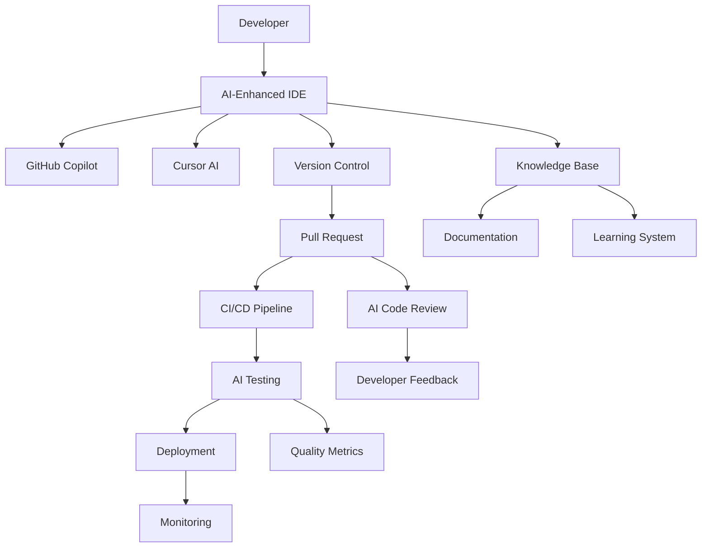

```yaml
---
state: permanent
type: source-document
source-type: comprehensive-guide
atomic-extracts: 1
created: 2025-06-13
last-reviewed: 2025-06-13
tags: [source, workflow-integration, ai-tools, enterprise-patterns, development-productivity]
---
```

# Workflow Integration Patterns for Enterprise AI Coding Assistants

## Executive Summary

This guide establishes proven workflow integration patterns for enterprise AI coding assistants, based on successful implementations at Fortune 500 companies including NVIDIA, Uber, Stripe, and Shopify. These patterns enable seamless integration of AI tools into existing development workflows while maximizing productivity gains and maintaining code quality.

### Key Integration Benefits
- **Unified Development Experience**: Single workflow across multiple AI tools
- **Reduced Context Switching**: Seamless transitions between tools and platforms
- **Enhanced Collaboration**: AI-powered team coordination and knowledge sharing
- **Automated Quality Gates**: AI-driven code review and testing integration
- **Intelligent Knowledge Management**: Contextual documentation and learning

### Supported Platforms
- GitHub Copilot Enterprise + GitHub Ecosystem
- Cursor IDE + VSCode Ecosystem  
- AI Testing Frameworks (ACCELQ, Testsigma, Katalon)
- CI/CD Platforms (Jenkins, Azure DevOps, GitHub Actions)
- Collaboration Tools (Slack, Teams, Jira, Confluence)

## Core Integration Architecture

### Multi-Tool Orchestration Framework



### Tool Synchronization Strategy

```yaml
synchronization_layers:
  configuration:
    # Unified settings across tools
    shared_settings:
      - code_style_preferences
      - language_configurations
      - project_templates
      - security_policies
    
    sync_mechanism: "git-based configuration repository"
    update_frequency: "real-time with 5-minute max delay"
  
  context:
    # Shared context between AI tools
    context_sharing:
      - current_task_context
      - recent_code_changes
      - active_discussions
      - documentation_updates
    
    context_store: "centralized knowledge graph"
    retention_period: "30 days active, 6 months archived"
  
  knowledge:
    # Unified knowledge base
    knowledge_sources:
      - codebase_documentation
      - api_specifications
      - best_practices_library
      - team_expertise_mapping
    
    knowledge_sync: "bi-directional with conflict resolution"
    update_triggers: ["commit", "documentation_change", "review_complete"]
```

## Development Workflow Patterns

### Pattern 1: AI-First Development Cycle

```python
# AI-First Development Workflow Implementation
class AIFirstWorkflow:
    def __init__(self):
        self.copilot = GitHubCopilot()
        self.cursor = CursorIDE()
        self.testing = AITestingFramework()
        self.knowledge_base = EnterpriseKnowledgeBase()
    
    def start_feature_development(self, feature_request):
        # Phase 1: AI-Assisted Planning
        context = self.knowledge_base.get_context(feature_request)
        plan = self.copilot.generate_implementation_plan(
            feature_request, context
        )
        
        # Phase 2: Intelligent Code Generation
        with self.cursor.start_session(plan) as session:
            # AI generates initial code structure
            initial_code = session.generate_scaffold(plan)
            
            # Developer refines with AI assistance
            refined_code = session.collaborative_refinement(
                initial_code, developer_input=True
            )
            
            # Phase 3: AI-Powered Testing
            test_suite = self.testing.generate_comprehensive_tests(
                refined_code, coverage_target=85
            )
            
            return {
                'implementation': refined_code,
                'tests': test_suite,
                'documentation': session.generate_docs(),
                'review_checklist': session.generate_review_items()
            }
    
    def continuous_optimization(self, code_metrics):
        # AI learns from metrics and suggests improvements
        optimizations = self.copilot.analyze_patterns(code_metrics)
        self.knowledge_base.update_best_practices(optimizations)
        return optimizations
```

### Pattern 2: Collaborative AI Code Review

```typescript
// Collaborative AI Code Review Pattern
interface AICodeReviewWorkflow {
  prCreated: (pullRequest: PullRequest) => Promise<ReviewResult>;
  humanReview: (review: ReviewResult) => Promise<EnhancedReview>;
  finalizeReview: (enhancedReview: EnhancedReview) => Promise<MergeDecision>;
}

class EnterpriseCodeReviewOrchestrator implements AICodeReviewWorkflow {
  constructor(
    private copilot: GitHubCopilotEnterprise,
    private cursor: CursorAnalytics,
    private testFramework: AITestFramework
  ) {}

  async prCreated(pullRequest: PullRequest): Promise<ReviewResult> {
    // AI performs initial comprehensive review
    const aiAnalysis = await Promise.all([
      this.copilot.reviewCodeQuality(pullRequest.diff),
      this.copilot.checkSecurityVulnerabilities(pullRequest.diff),
      this.copilot.validateArchitectureCompliance(pullRequest.diff),
      this.testFramework.generateMissingTests(pullRequest.diff)
    ]);

    // Cursor provides contextual insights
    const contextualAnalysis = await this.cursor.analyzeCodebaseImpact(
      pullRequest.diff,
      pullRequest.targetBranch
    );

    return {
      qualityScore: aiAnalysis[0].score,
      securityIssues: aiAnalysis[1].vulnerabilities,
      architectureViolations: aiAnalysis[2].violations,
      testCoverage: aiAnalysis[3].coverage,
      contextualImpact: contextualAnalysis,
      aiRecommendations: this.synthesizeRecommendations(aiAnalysis),
      estimatedReviewTime: this.calculateReviewComplexity(pullRequest)
    };
  }

  async humanReview(review: ReviewResult): Promise<EnhancedReview> {
    // Human reviewer enhances AI analysis
    const humanInsights = await this.collectHumanFeedback(review);
    
    // AI learns from human corrections
    await this.copilot.updateReviewModel(review, humanInsights);
    
    return {
      ...review,
      humanValidation: humanInsights.validation,
      additionalConcerns: humanInsights.concerns,
      businessLogicReview: humanInsights.businessLogic,
      learningUpdates: humanInsights.aiCorrections
    };
  }

  async finalizeReview(enhancedReview: EnhancedReview): Promise<MergeDecision> {
    // AI synthesizes final decision with human input
    const decision = await this.copilot.synthesizeMergeDecision(
      enhancedReview,
      this.getProjectRiskTolerance()
    );

    // Update knowledge base with learnings
    await this.updateKnowledgeBase(enhancedReview, decision);

    return decision;
  }
}
```

### Pattern 3: Intelligent Test-Driven Development

```java
// AI-Enhanced Test-Driven Development Pattern
@Component
public class AITestDrivenWorkflow {
    
    @Autowired private TestsigmaAPI testsigma;
    @Autowired private ACCELQFramework accelq;
    @Autowired private GitHubCopilot copilot;
    
    public DevelopmentCycle startTDD(FeatureSpecification spec) {
        // Phase 1: AI generates comprehensive test scenarios
        List<TestScenario> scenarios = testsigma.generateTestScenarios(
            spec.getRequirements(),
            spec.getAcceptanceCriteria()
        );
        
        // Phase 2: Create failing tests using natural language
        List<Test> failingTests = scenarios.stream()
            .map(scenario -> testsigma.createTestFromNaturalLanguage(
                scenario.getDescription(),
                scenario.getExpectedBehavior()
            ))
            .collect(Collectors.toList());
        
        // Phase 3: AI-assisted implementation
        Implementation implementation = copilot.generateImplementation(
            failingTests,
            spec.getArchitecturalConstraints()
        );
        
        // Phase 4: Self-healing test execution
        ExecutionResult result = accelq.executeWithAutoHealing(
            failingTests,
            implementation
        );
        
        // Phase 5: Continuous refinement
        return new DevelopmentCycle(
            scenarios,
            failingTests,
            implementation,
            result,
            this::refineBasedOnResults
        );
    }
    
    private void refineBasedOnResults(ExecutionResult result) {
        if (!result.allTestsPassing()) {
            // AI analyzes failures and suggests fixes
            List<Fix> suggestions = copilot.analyzeFalures(result.getFailures());
            
            // Apply AI-suggested fixes
            suggestions.forEach(fix -> {
                if (fix.getConfidence() > 0.8) {
                    fix.apply();
                } else {
                    // Queue for human review
                    reviewQueue.add(fix);
                }
            });
        }
        
        // Update test suite intelligence
        testsigma.learnFromExecution(result);
    }
}
```

## Team Collaboration Patterns

### Pattern 4: AI-Powered Knowledge Sharing

```yaml
# Knowledge Sharing Workflow Configuration
knowledge_sharing:
  real_time_collaboration:
    # AI monitors team activities and suggests knowledge sharing
    monitoring:
      - code_patterns_discovery: "real-time"
      - expertise_identification: "continuous"
      - knowledge_gaps_detection: "daily"
    
    suggestions:
      - pair_programming_recommendations: "based_on_complementary_skills"
      - documentation_updates: "triggered_by_code_changes"
      - learning_opportunities: "skill_gap_based"
  
  automated_documentation:
    # AI generates and maintains documentation
    generation_triggers:
      - new_feature_completion
      - api_changes
      - architecture_updates
      - bug_fixes_with_lessons_learned
    
    documentation_types:
      - api_documentation: "swagger_plus_ai_examples"
      - architecture_decisions: "adr_with_ai_context"
      - onboarding_guides: "role_specific_ai_generated"
      - troubleshooting_guides: "incident_driven_ai_updates"
  
  intelligent_code_search:
    # AI-enhanced code discovery and reuse
    search_capabilities:
      - semantic_code_search: "natural_language_queries"
      - pattern_recognition: "similar_implementation_detection"
      - expertise_location: "who_knows_what_mapping"
      - historical_context: "change_history_with_reasoning"
```

### Pattern 5: Cross-Platform Context Synchronization

```python
# Cross-Platform Context Synchronization
class ContextSynchronizationOrchestrator:
    def __init__(self):
        self.platforms = {
            'github_copilot': GitHubCopilotConnector(),
            'cursor_ide': CursorIDEConnector(),
            'jira': JiraConnector(),
            'slack': SlackConnector(),
            'confluence': ConfluenceConnector()
        }
        self.context_store = CentralizedContextStore()
        self.ai_synthesizer = ContextSynthesizer()
    
    async def synchronize_context(self, trigger_event):
        """Synchronize context across all platforms when triggered by any event"""
        
        # Collect current context from all platforms
        contexts = await asyncio.gather(*[
            platform.get_current_context() 
            for platform in self.platforms.values()
        ])
        
        # AI synthesizes unified context
        unified_context = await self.ai_synthesizer.synthesize(
            contexts, trigger_event
        )
        
        # Update all platforms with enriched context
        updates = await self.ai_synthesizer.generate_platform_updates(
            unified_context, self.platforms.keys()
        )
        
        # Apply updates asynchronously
        await asyncio.gather(*[
            self.platforms[platform].update_context(update)
            for platform, update in updates.items()
        ])
        
        # Store for future reference and learning
        await self.context_store.store_context_evolution(
            trigger_event, contexts, unified_context, updates
        )
    
    async def predict_context_needs(self, developer_activity):
        """Proactively prepare context based on predicted needs"""
        
        # AI predicts what context will be needed
        predictions = await self.ai_synthesizer.predict_context_needs(
            developer_activity,
            await self.context_store.get_historical_patterns()
        )
        
        # Pre-load predicted context
        for prediction in predictions:
            if prediction.confidence > 0.7:
                await self.pre_load_context(prediction)
```

## CI/CD Integration Patterns

### Pattern 6: AI-Enhanced Continuous Integration

```yaml
# AI-Enhanced CI/CD Pipeline Configuration
name: AI-Enhanced Continuous Integration

on:
  pull_request:
    types: [opened, synchronize, reopened]
  push:
    branches: [main, develop]

jobs:
  ai-code-analysis:
    runs-on: ubuntu-latest
    steps:
      - uses: actions/checkout@v3
      
      # AI-powered code quality analysis
      - name: GitHub Copilot Code Review
        uses: github/copilot-code-review@v1
        with:
          enterprise-knowledge-base: true
          security-scan: true
          architecture-compliance: true
      
      # Cursor IDE contextual analysis
      - name: Cursor Codebase Analysis
        run: |
          curl -X POST "$CURSOR_API_ENDPOINT/analyze" \
            -H "Authorization: Bearer $CURSOR_API_TOKEN" \
            -d '{
              "repository": "${{ github.repository }}",
              "commit": "${{ github.sha }}",
              "analysis_type": "full_context"
            }'
      
      # AI test generation and execution
      - name: Generate and Execute AI Tests
        uses: testsigma/ai-test-action@v2
        with:
          test-generation: "natural-language"
          self-healing: true
          coverage-target: 85
          execution-parallel: true
  
  ai-deployment-readiness:
    needs: ai-code-analysis
    runs-on: ubuntu-latest
    steps:
      # AI deployment risk assessment
      - name: AI Deployment Risk Analysis
        run: |
          python scripts/ai_deployment_risk.py \
            --code-analysis-results "${{ needs.ai-code-analysis.outputs.results }}" \
            --deployment-target "${{ github.ref }}" \
            --risk-tolerance "enterprise"
      
      # AI-powered rollback strategy
      - name: Generate AI Rollback Plan
        if: steps.risk-analysis.outputs.risk-score > 0.3
        uses: ai-ops/rollback-planner@v1
        with:
          deployment-config: ./.deployment/config.yml
          risk-factors: ${{ steps.risk-analysis.outputs.risk-factors }}
```

### Pattern 7: Intelligent Deployment Orchestration

```typescript
// Intelligent Deployment Orchestration
interface DeploymentIntelligence {
  riskAssessment: (deployment: DeploymentPlan) => Promise<RiskScore>;
  rollbackStrategy: (deployment: DeploymentPlan) => Promise<RollbackPlan>;
  monitoringSetup: (deployment: DeploymentPlan) => Promise<MonitoringConfig>;
}

class AIDeploymentOrchestrator implements DeploymentIntelligence {
  constructor(
    private aiAnalyzer: DeploymentAnalyzer,
    private monitoringAI: MonitoringIntelligence,
    private copilot: GitHubCopilotEnterprise
  ) {}

  async riskAssessment(deployment: DeploymentPlan): Promise<RiskScore> {
    const analyses = await Promise.all([
      this.aiAnalyzer.analyzeCodeChanges(deployment.changeset),
      this.aiAnalyzer.assessInfrastructureImpact(deployment.infrastructure),
      this.aiAnalyzer.evaluateDataMigrations(deployment.migrations),
      this.copilot.reviewDeploymentSafety(deployment)
    ]);

    return this.aiAnalyzer.synthesizeRiskScore(analyses);
  }

  async rollbackStrategy(deployment: DeploymentPlan): Promise<RollbackPlan> {
    // AI generates comprehensive rollback strategy
    const rollbackAnalysis = await this.aiAnalyzer.generateRollbackPlan({
      deployment,
      currentState: await this.getCurrentSystemState(),
      historicalPatterns: await this.getHistoricalDeploymentPatterns()
    });

    // Include AI-powered monitoring for rollback triggers
    const rollbackTriggers = await this.monitoringAI.defineRollbackTriggers(
      deployment,
      rollbackAnalysis.riskFactors
    );

    return {
      ...rollbackAnalysis,
      automatedTriggers: rollbackTriggers,
      validationSteps: await this.generateValidationSteps(deployment),
      communicationPlan: await this.generateCommunicationPlan(deployment)
    };
  }

  async monitoringSetup(deployment: DeploymentPlan): Promise<MonitoringConfig> {
    // AI determines optimal monitoring configuration
    const monitoringStrategy = await this.monitoringAI.designMonitoringStrategy({
      deployment,
      systemCharacteristics: await this.getSystemCharacteristics(),
      businessCriticality: deployment.businessImpact
    });

    return {
      metrics: monitoringStrategy.keyMetrics,
      alerts: monitoringStrategy.intelligentAlerts,
      dashboards: monitoringStrategy.contextualDashboards,
      automatedResponses: monitoringStrategy.selfHealingActions
    };
  }
}
```

## Quality Assurance Integration

### Pattern 8: AI-Driven Quality Gates

```python
# AI-Driven Quality Gates Implementation
class QualityGateOrchestrator:
    def __init__(self):
        self.quality_analyzers = {
            'code_quality': GitHubCopilotQualityAnalyzer(),
            'security': SecurityAnalyzer(),
            'performance': PerformanceAnalyzer(),
            'accessibility': AccessibilityAnalyzer(),
            'testing': AITestingFramework()
        }
        self.decision_engine = QualityDecisionEngine()
        self.learning_system = QualityLearningSystem()
    
    async def evaluate_quality_gates(self, changeset, context):
        """Comprehensive AI-driven quality evaluation"""
        
        # Parallel quality analysis
        quality_results = await asyncio.gather(*[
            analyzer.analyze(changeset, context)
            for analyzer in self.quality_analyzers.values()
        ])
        
        # AI synthesizes overall quality assessment
        quality_assessment = await self.decision_engine.synthesize_assessment(
            quality_results,
            context.project_standards,
            context.business_criticality
        )
        
        # Generate intelligent recommendations
        recommendations = await self.generate_intelligent_recommendations(
            quality_assessment,
            changeset,
            context
        )
        
        # Update learning system
        await self.learning_system.update_quality_patterns(
            changeset,
            quality_assessment,
            recommendations
        )
        
        return QualityGateResult(
            overall_score=quality_assessment.score,
            gate_status=quality_assessment.status,
            recommendations=recommendations,
            detailed_analysis=quality_results,
            improvement_suggestions=quality_assessment.improvements
        )
    
    async def generate_intelligent_recommendations(self, assessment, changeset, context):
        """AI generates contextual improvement recommendations"""
        
        recommendations = []
        
        # Code quality improvements
        if assessment.code_quality_score < context.quality_threshold:
            code_suggestions = await self.quality_analyzers['code_quality'].suggest_improvements(
                changeset,
                assessment.code_quality_issues
            )
            recommendations.extend(code_suggestions)
        
        # Security enhancements
        if assessment.security_vulnerabilities:
            security_fixes = await self.quality_analyzers['security'].generate_security_fixes(
                assessment.security_vulnerabilities,
                context.security_policies
            )
            recommendations.extend(security_fixes)
        
        # Performance optimizations
        if assessment.performance_concerns:
            perf_optimizations = await self.quality_analyzers['performance'].suggest_optimizations(
                changeset,
                context.performance_requirements
            )
            recommendations.extend(perf_optimizations)
        
        # Testing improvements
        if assessment.test_coverage < context.coverage_threshold:
            test_suggestions = await self.quality_analyzers['testing'].generate_additional_tests(
                changeset,
                context.testing_standards
            )
            recommendations.extend(test_suggestions)
        
        return self.prioritize_recommendations(recommendations, context)
```

## Monitoring and Analytics Integration

### Pattern 9: Intelligent Development Analytics

```typescript
// Intelligent Development Analytics Pattern
interface DevelopmentAnalytics {
  trackProductivity: (team: Team) => Promise<ProductivityMetrics>;
  identifyBottlenecks: (workflow: WorkflowData) => Promise<BottleneckAnalysis>;
  predictDelivery: (project: Project) => Promise<DeliveryPrediction>;
  optimizeWorkflow: (analytics: AnalyticsData) => Promise<OptimizationSuggestions>;
}

class AIAnalyticsOrchestrator implements DevelopmentAnalytics {
  constructor(
    private copilotAnalytics: GitHubCopilotAnalytics,
    private cursorAnalytics: CursorAnalytics,
    private aiInsights: AIInsightsEngine
  ) {}

  async trackProductivity(team: Team): Promise<ProductivityMetrics> {
    // Collect metrics from all AI tools
    const [copilotMetrics, cursorMetrics, workflowMetrics] = await Promise.all([
      this.copilotAnalytics.getTeamProductivity(team.id),
      this.cursorAnalytics.getTeamEfficiency(team.id),
      this.getWorkflowMetrics(team.id)
    ]);

    // AI synthesizes comprehensive productivity view
    const synthesizedMetrics = await this.aiInsights.synthesizeProductivity({
      copilotUsage: copilotMetrics,
      cursorEfficiency: cursorMetrics,
      workflowData: workflowMetrics,
      teamContext: team.context
    });

    return {
      overallProductivity: synthesizedMetrics.overallScore,
      aiAssistanceEffectiveness: synthesizedMetrics.aiEffectiveness,
      codeQualityTrends: synthesizedMetrics.qualityTrends,
      collaborationEfficiency: synthesizedMetrics.collaborationScore,
      learningVelocity: synthesizedMetrics.learningRate,
      recommendations: synthesizedMetrics.recommendations
    };
  }

  async identifyBottlenecks(workflow: WorkflowData): Promise<BottleneckAnalysis> {
    // AI analyzes workflow patterns to identify bottlenecks
    const bottleneckAnalysis = await this.aiInsights.analyzeWorkflowBottlenecks({
      codeReviewTimes: workflow.reviewMetrics,
      testingCycles: workflow.testingMetrics,
      deploymentFrequency: workflow.deploymentMetrics,
      communicationPatterns: workflow.collaborationMetrics
    });

    // Generate AI-powered solutions
    const solutions = await this.aiInsights.generateBottleneckSolutions(
      bottleneckAnalysis,
      workflow.teamCapabilities
    );

    return {
      bottlenecks: bottleneckAnalysis.identifiedBottlenecks,
      impactAnalysis: bottleneckAnalysis.impactAssessment,
      rootCauses: bottleneckAnalysis.rootCauseAnalysis,
      solutions: solutions,
      implementationPlan: await this.generateImplementationPlan(solutions)
    };
  }

  async predictDelivery(project: Project): Promise<DeliveryPrediction> {
    // AI predicts delivery timelines based on multiple factors
    const predictionFactors = await this.gatherPredictionFactors(project);
    
    const prediction = await this.aiInsights.predictDeliveryTimeline({
      projectScope: project.scope,
      teamVelocity: predictionFactors.velocity,
      historicalPatterns: predictionFactors.historical,
      currentProgress: predictionFactors.progress,
      riskFactors: predictionFactors.risks
    });

    return {
      estimatedDelivery: prediction.deliveryDate,
      confidenceLevel: prediction.confidence,
      riskFactors: prediction.risks,
      mitigationStrategies: prediction.mitigations,
      milestoneForecasts: prediction.milestones,
      resourceRecommendations: prediction.resourceNeeds
    };
  }
}
```

## Knowledge Management Integration

### Pattern 10: AI-Powered Documentation Ecosystem

```yaml
# AI-Powered Documentation Ecosystem Configuration
documentation_ecosystem:
  automated_generation:
    triggers:
      - code_changes: "api_modifications, new_features"
      - architecture_updates: "system_design_changes"
      - deployment_changes: "infrastructure_updates"
      - issue_resolutions: "bug_fixes_with_learnings"
    
    generation_types:
      api_documentation:
        format: "openapi_3.0_plus_ai_examples"
        includes: ["usage_examples", "error_scenarios", "best_practices"]
        auto_update: true
        review_required: false
      
      architecture_documentation:
        format: "c4_model_plus_ai_insights"
        includes: ["decision_rationale", "trade_offs", "alternatives"]
        auto_update: false
        review_required: true
      
      user_guides:
        format: "interactive_tutorials"
        includes: ["step_by_step", "troubleshooting", "faqs"]
        personalization: "role_based"
        auto_update: true
  
  intelligent_search:
    capabilities:
      - semantic_search: "natural_language_queries"
      - contextual_suggestions: "based_on_current_task"
      - expertise_location: "who_to_ask_for_what"
      - historical_context: "why_decisions_were_made"
    
    integration_points:
      - ide_integration: "copilot_and_cursor"
      - chat_platforms: "slack_teams_integration"
      - issue_tracking: "jira_github_issues"
      - code_review: "pull_request_context"
  
  continuous_improvement:
    feedback_loops:
      - usage_analytics: "what_docs_are_most_useful"
      - gap_identification: "what_questions_go_unanswered"
      - quality_assessment: "accuracy_and_completeness"
      - outdated_content_detection: "automated_staleness_detection"
    
    ai_curation:
      - content_consolidation: "merge_redundant_information"
      - gap_filling: "generate_missing_documentation"
      - quality_enhancement: "improve_clarity_and_examples"
      - personalization: "role_and_experience_based_content"
```

## Team Onboarding Patterns

### Pattern 11: Intelligent Developer Onboarding

```python
# Intelligent Developer Onboarding System
class AIOnboardingOrchestrator:
    def __init__(self):
        self.skill_assessor = SkillAssessmentAI()
        self.learning_path_generator = LearningPathAI()
        self.mentor_matcher = MentorMatchingAI()
        self.progress_tracker = ProgressTrackingAI()
        self.knowledge_base = EnterpriseKnowledgeBase()
    
    async def create_personalized_onboarding(self, new_developer):
        """Create personalized onboarding experience using AI"""
        
        # AI assesses current skills and experience
        skill_assessment = await self.skill_assessor.assess_developer(
            new_developer.resume,
            new_developer.github_profile,
            new_developer.coding_samples
        )
        
        # Generate personalized learning path
        learning_path = await self.learning_path_generator.create_path(
            skill_assessment,
            new_developer.role_requirements,
            team_context=new_developer.team.context
        )
        
        # Match with appropriate mentors
        mentor_recommendations = await self.mentor_matcher.find_mentors(
            skill_assessment,
            learning_path,
            team_members=new_developer.team.members
        )
        
        # Set up AI-powered tools
        ai_tools_setup = await self.setup_ai_tools(
            new_developer,
            skill_assessment
        )
        
        return OnboardingPlan(
            skill_assessment=skill_assessment,
            learning_path=learning_path,
            mentors=mentor_recommendations,
            ai_tools=ai_tools_setup,
            milestones=learning_path.milestones,
            estimated_duration=learning_path.duration
        )
    
    async def setup_ai_tools(self, developer, skill_assessment):
        """Configure AI tools based on developer skill level"""
        
        configurations = {}
        
        # GitHub Copilot configuration
        if skill_assessment.experience_level == "beginner":
            configurations['github_copilot'] = {
                'suggestion_aggressiveness': 'high',
                'explanation_detail': 'verbose',
                'best_practices_highlighting': True,
                'learning_mode': True
            }
        elif skill_assessment.experience_level == "advanced":
            configurations['github_copilot'] = {
                'suggestion_aggressiveness': 'moderate',
                'explanation_detail': 'concise',
                'advanced_patterns': True,
                'architecture_awareness': True
            }
        
        # Cursor IDE configuration
        configurations['cursor_ide'] = {
            'codebase_familiarization': True,
            'guided_exploration': skill_assessment.experience_level == "beginner",
            'advanced_refactoring': skill_assessment.experience_level == "advanced",
            'learning_assistance': True
        }
        
        # AI Testing tools
        if 'testing' in skill_assessment.skill_gaps:
            configurations['ai_testing'] = {
                'tutorial_mode': True,
                'test_explanation': 'detailed',
                'pattern_learning': True
            }
        
        return configurations
    
    async def track_onboarding_progress(self, developer, onboarding_plan):
        """AI-powered progress tracking and adaptation"""
        
        # Collect progress data from all sources
        progress_data = await self.progress_tracker.collect_progress(
            developer,
            onboarding_plan,
            data_sources=['git_activity', 'ai_tool_usage', 'mentor_feedback', 'peer_interactions']
        )
        
        # AI analyzes progress and identifies issues
        progress_analysis = await self.progress_tracker.analyze_progress(
            progress_data,
            onboarding_plan.milestones
        )
        
        # Adapt plan if necessary
        if progress_analysis.requires_adaptation:
            adapted_plan = await self.learning_path_generator.adapt_plan(
                onboarding_plan,
                progress_analysis.insights,
                progress_analysis.challenges
            )
            return adapted_plan
        
        return onboarding_plan
```

## Performance Optimization Patterns

### Pattern 12: AI-Driven Workflow Optimization

```typescript
// AI-Driven Workflow Optimization
interface WorkflowOptimization {
  analyzeWorkflowEfficiency: (team: Team) => Promise<EfficiencyAnalysis>;
  optimizeToolUsage: (usage: ToolUsageData) => Promise<OptimizationPlan>;
  predictProductivityImpact: (changes: WorkflowChanges) => Promise<ImpactPrediction>;
}

class WorkflowOptimizationEngine implements WorkflowOptimization {
  constructor(
    private analytics: WorkflowAnalytics,
    private optimizer: AIOptimizer,
    private predictor: ProductivityPredictor
  ) {}

  async analyzeWorkflowEfficiency(team: Team): Promise<EfficiencyAnalysis> {
    // Collect comprehensive workflow data
    const workflowData = await this.analytics.collectWorkflowData(team, {
      timeframe: '30days',
      granularity: 'task_level',
      include_ai_interactions: true
    });

    // AI analyzes efficiency patterns
    const efficiency = await this.optimizer.analyzeEfficiency({
      taskCompletionTimes: workflowData.tasks,
      aiToolInteractions: workflowData.aiUsage,
      collaborationPatterns: workflowData.collaboration,
      codeQualityMetrics: workflowData.quality,
      deploymentCycles: workflowData.deployments
    });

    return {
      overallEfficiency: efficiency.score,
      bottleneckIdentification: efficiency.bottlenecks,
      aiUtilizationOptimization: efficiency.aiOptimizations,
      collaborationImprovements: efficiency.collaborationOptimizations,
      recommendations: efficiency.actionableRecommendations
    };
  }

  async optimizeToolUsage(usage: ToolUsageData): Promise<OptimizationPlan> {
    // AI identifies suboptimal tool usage patterns
    const usageAnalysis = await this.optimizer.analyzeToolUsage(usage);
    
    // Generate optimization strategies
    const optimizations = await this.optimizer.generateOptimizations({
      copilotUsage: usageAnalysis.copilot,
      cursorUsage: usageAnalysis.cursor,
      testingToolUsage: usageAnalysis.testing,
      crossToolSynergies: usageAnalysis.synergies
    });

    return {
      toolConfigChanges: optimizations.configurations,
      workflowAdjustments: optimizations.workflows,
      trainingRecommendations: optimizations.training,
      integrationImprovements: optimizations.integrations,
      expectedImpact: await this.predictor.predictOptimizationImpact(optimizations)
    };
  }

  async predictProductivityImpact(changes: WorkflowChanges): Promise<ImpactPrediction> {
    // AI predicts the impact of proposed workflow changes
    const prediction = await this.predictor.predictImpact({
      proposedChanges: changes,
      currentBaseline: await this.analytics.getCurrentBaseline(),
      historicalPatterns: await this.analytics.getHistoricalPatterns(),
      teamCharacteristics: await this.analytics.getTeamCharacteristics()
    });

    return {
      productivityChange: prediction.productivityDelta,
      qualityImpact: prediction.qualityDelta,
      adaptationTime: prediction.adaptationPeriod,
      riskFactors: prediction.risks,
      mitigationStrategies: prediction.mitigations,
      rollbackPlan: prediction.rollbackStrategy
    };
  }
}
```

## Troubleshooting and Support Integration

### Pattern 13: Intelligent Support Orchestration

```yaml
# Intelligent Support Orchestration Configuration
support_orchestration:
  issue_detection:
    monitoring_sources:
      - ai_tool_performance: "response_times, error_rates"
      - developer_behavior: "usage_patterns, satisfaction_signals"
      - workflow_metrics: "completion_times, quality_indicators"
      - system_health: "infrastructure_metrics, service_availability"
    
    ai_analysis:
      pattern_recognition: "anomaly_detection_ml"
      root_cause_analysis: "multi_factor_correlation"
      impact_assessment: "business_and_technical_impact"
      escalation_prediction: "issue_severity_forecasting"
  
  automated_resolution:
    self_healing_capabilities:
      - configuration_drift_correction: "auto_remediation"
      - performance_optimization: "dynamic_resource_allocation"
      - integration_issue_resolution: "connection_restoration"
      - cache_and_index_maintenance: "automated_cleanup"
    
    guided_resolution:
      - interactive_troubleshooting: "step_by_step_ai_guidance"
      - contextual_documentation: "relevant_docs_surfacing"
      - expert_recommendations: "escalation_to_human_experts"
      - solution_learning: "resolution_pattern_capture"
  
  knowledge_evolution:
    continuous_learning:
      - issue_pattern_updates: "ml_model_training"
      - solution_effectiveness: "outcome_tracking"
      - documentation_improvement: "gap_identification"
      - expertise_development: "team_capability_growth"
```

## Success Metrics and Continuous Improvement

### Key Performance Indicators (KPIs)

```python
# Comprehensive KPI Tracking for AI Workflow Integration
class WorkflowIntegrationKPIs:
    def __init__(self):
        self.metrics_collector = MetricsCollector()
        self.analytics_engine = AnalyticsEngine()
        self.reporting_system = ReportingSystem()
    
    def collect_integration_metrics(self):
        return {
            'productivity_metrics': {
                'code_velocity': self.measure_code_velocity(),
                'ai_assistance_efficiency': self.measure_ai_efficiency(),
                'workflow_completion_time': self.measure_workflow_time(),
                'context_switching_reduction': self.measure_context_switching()
            },
            'quality_metrics': {
                'code_quality_improvement': self.measure_quality_improvement(),
                'defect_reduction': self.measure_defect_reduction(),
                'test_coverage_increase': self.measure_test_coverage(),
                'review_efficiency': self.measure_review_efficiency()
            },
            'collaboration_metrics': {
                'knowledge_sharing_frequency': self.measure_knowledge_sharing(),
                'cross_team_coordination': self.measure_coordination(),
                'mentor_mentee_effectiveness': self.measure_mentoring(),
                'documentation_utilization': self.measure_doc_usage()
            },
            'adoption_metrics': {
                'tool_utilization_rate': self.measure_tool_adoption(),
                'feature_discovery_rate': self.measure_feature_discovery(),
                'user_satisfaction_score': self.measure_satisfaction(),
                'training_effectiveness': self.measure_training_success()
            }
        }
```

## Implementation Checklist

### Phase 1: Foundation Setup (Weeks 1-4)
- [ ] Multi-platform authentication and SSO integration
- [ ] Centralized configuration management system
- [ ] Knowledge base initialization and indexing
- [ ] Security policy configuration and enforcement
- [ ] Basic workflow orchestration setup

### Phase 2: Core Integration (Weeks 5-8)
- [ ] GitHub Copilot Enterprise workflow integration
- [ ] Cursor IDE team deployment and configuration
- [ ] AI testing framework integration
- [ ] CI/CD pipeline enhancement with AI capabilities
- [ ] Cross-platform context synchronization

### Phase 3: Advanced Workflows (Weeks 9-12)
- [ ] Intelligent code review orchestration
- [ ] AI-enhanced deployment pipelines
- [ ] Comprehensive quality gate automation
- [ ] Advanced analytics and monitoring setup
- [ ] Knowledge management ecosystem activation

### Phase 4: Optimization and Scaling (Weeks 13-16)
- [ ] Workflow efficiency optimization
- [ ] Performance tuning and resource optimization
- [ ] Advanced team collaboration patterns
- [ ] Continuous learning system activation
- [ ] Enterprise-wide rollout preparation

## Extracted Atomic Notes

The following key concepts have been extracted from this comprehensive guide:

- [[AI-Powered Documentation Ecosystem]] - Integrated system for automated documentation generation and intelligent knowledge management

---

## Conclusion

Effective workflow integration of enterprise AI coding assistants requires:

1. **Strategic Orchestration**: Unified approach across all development tools and platforms
2. **Intelligent Automation**: AI-driven workflow optimization and decision-making
3. **Seamless Collaboration**: Enhanced team coordination through AI-powered insights
4. **Continuous Learning**: Adaptive systems that improve over time
5. **Quality Excellence**: Automated quality gates and intelligent testing integration

Organizations implementing these patterns can expect to achieve the productivity gains demonstrated by leading tech companies while maintaining high standards of code quality, security, and team collaboration.

The key to success is starting with foundational patterns and gradually implementing more advanced orchestration capabilities as teams become proficient with AI-enhanced workflows.