# Productivity Measurement Framework for Enterprise AI Coding Assistants

## Executive Summary

This framework provides comprehensive methodologies for measuring, tracking, and optimizing productivity gains from enterprise AI coding assistant implementations. Based on empirical data from Fortune 500 companies and industry research, organizations can expect to achieve and validate:

- **50-55% sustained productivity improvements** within 6-12 months
- **40% reduction in debugging time** through AI-assisted problem resolution
- **30% faster deployment cycles** via automated quality and testing
- **25% improvement in code quality metrics** through AI-powered reviews
- **ROI of 300-500%** within the first year of implementation

### Framework Benefits
- **Baseline Establishment**: Accurate pre-implementation productivity measurement
- **ROI Validation**: Quantifiable business value demonstration
- **Continuous Optimization**: Data-driven improvement identification
- **Stakeholder Communication**: Clear progress reporting and value articulation
- **Competitive Analysis**: Benchmarking against industry standards

## Measurement Architecture

### Multi-Dimensional Productivity Model

```mermaid
graph TB
    Productivity[Overall Productivity] --> Velocity[Development Velocity]
    Productivity --> Quality[Code Quality]
    Productivity --> Efficiency[Process Efficiency]
    Productivity --> Innovation[Innovation Capacity]
    
    Velocity --> CodeOutput[Code Output Metrics]
    Velocity --> DeliverySpeed[Delivery Speed Metrics]
    Velocity --> FeatureCompletion[Feature Completion Metrics]
    
    Quality --> Defects[Defect Metrics]
    Quality --> Testing[Testing Metrics]
    Quality --> Maintainability[Maintainability Metrics]
    
    Efficiency --> ResourceUtilization[Resource Utilization]
    Efficiency --> ProcessOptimization[Process Optimization]
    Efficiency --> ToolEffectiveness[Tool Effectiveness]
    
    Innovation --> ExperimentationRate[Experimentation Rate]
    Innovation --> TechnicalDebt[Technical Debt Reduction]
    Innovation --> LearningVelocity[Learning Velocity]
```



### Data Collection Framework

```yaml
data_collection:
  automated_metrics:
    source_systems:
      - version_control: ["github", "gitlab", "bitbucket"]
      - ci_cd_platforms: ["jenkins", "azure_devops", "github_actions"]
      - project_management: ["jira", "azure_boards", "linear"]
      - ai_platforms: ["github_copilot", "cursor", "ai_testing_tools"]
      - monitoring_systems: ["datadog", "new_relic", "splunk"]
    
    collection_frequency:
      - real_time: ["commits", "pull_requests", "ai_interactions"]
      - hourly: ["build_metrics", "test_results", "deployment_status"]
      - daily: ["productivity_aggregates", "quality_metrics"]
      - weekly: ["team_performance", "velocity_trends"]
      - monthly: ["strategic_metrics", "roi_calculations"]
  
  human_metrics:
    survey_instruments:
      - developer_satisfaction: "monthly_pulse_surveys"
      - tool_effectiveness: "quarterly_detailed_surveys"
      - workflow_efficiency: "bi_annual_comprehensive_assessment"
    
    observational_data:
      - pair_programming_sessions: "effectiveness_ratings"
      - code_review_quality: "review_thoroughness_scores"
      - learning_velocity: "skill_acquisition_tracking"
    
    feedback_mechanisms:
      - continuous_feedback: "slack_bot_micro_surveys"
      - retrospective_insights: "sprint_retrospective_data"
      - exit_interviews: "departing_developer_insights"
```

## Core Productivity Metrics

### 1. Development Velocity Metrics

#### Code Output Measurements
```python
# Development Velocity Tracking System
class DevelopmentVelocityTracker:
    def __init__(self):
        self.git_analyzer = GitAnalyzer()
        self.ai_usage_tracker = AIUsageTracker()
        self.quality_assessor = CodeQualityAssessor()
    
    def measure_code_velocity(self, time_period, team_id):
        """Comprehensive code velocity measurement"""
        
        base_metrics = {
            'lines_of_code_per_day': self.calculate_loc_per_day(time_period, team_id),
            'commits_per_developer_per_day': self.calculate_commits_per_day(time_period, team_id),
            'pull_requests_per_week': self.calculate_prs_per_week(time_period, team_id),
            'story_points_completed_per_sprint': self.calculate_story_points(time_period, team_id)
        }
        
        # AI-enhanced metrics
        ai_metrics = {
            'ai_assisted_code_percentage': self.calculate_ai_assistance_ratio(time_period, team_id),
            'ai_suggestion_acceptance_rate': self.calculate_acceptance_rate(time_period, team_id),
            'ai_generated_test_coverage': self.calculate_ai_test_coverage(time_period, team_id),
            'ai_code_review_efficiency': self.calculate_review_efficiency(time_period, team_id)
        }
        
        # Quality-adjusted velocity
        quality_adjustment = self.quality_assessor.calculate_quality_factor(
            base_metrics, time_period, team_id
        )
        
        return {
            'raw_velocity': base_metrics,
            'ai_enhanced_velocity': ai_metrics,
            'quality_adjusted_velocity': self.apply_quality_adjustment(base_metrics, quality_adjustment),
            'velocity_trend': self.calculate_velocity_trend(time_period, team_id),
            'ai_impact_analysis': self.analyze_ai_impact(base_metrics, ai_metrics)
        }
    
    def calculate_ai_assistance_ratio(self, time_period, team_id):
        """Calculate percentage of code written with AI assistance"""
        
        total_commits = self.git_analyzer.get_commits(time_period, team_id)
        ai_assisted_commits = self.ai_usage_tracker.get_ai_commits(time_period, team_id)
        
        return {
            'github_copilot_ratio': ai_assisted_commits['copilot'] / total_commits,
            'cursor_assistance_ratio': ai_assisted_commits['cursor'] / total_commits,
            'combined_ai_ratio': sum(ai_assisted_commits.values()) / total_commits,
            'productivity_correlation': self.calculate_ai_productivity_correlation(
                ai_assisted_commits, total_commits
            )
        }
```

#### Feature Delivery Speed
```typescript
// Feature Delivery Speed Measurement
interface FeatureDeliveryMetrics {
  cycleTime: Duration;
  leadTime: Duration;
  deploymentFrequency: number;
  changeFailureRate: number;
  meanTimeToRecovery: Duration;
}

class FeatureDeliveryTracker {
  constructor(
    private jiraConnector: JiraConnector,
    private gitConnector: GitConnector,
    private deploymentTracker: DeploymentTracker,
    private aiMetricsCollector: AIMetricsCollector
  ) {}

  async measureDeliverySpeed(timeframe: TimeFrame): Promise<FeatureDeliveryMetrics> {
    // Collect raw delivery data
    const deliveryData = await this.collectDeliveryData(timeframe);
    
    // Calculate DORA metrics enhanced with AI insights
    const doraMetrics = await this.calculateEnhancedDORAMetrics(deliveryData);
    
    // Analyze AI impact on delivery speed
    const aiImpactAnalysis = await this.analyzeAIImpactOnDelivery(deliveryData);
    
    return {
      ...doraMetrics,
      aiEnhancedMetrics: {
        aiAssistedFeatureRatio: aiImpactAnalysis.assistedFeatureRatio,
        aiTestGenerationImpact: aiImpactAnalysis.testingSpeedup,
        aiCodeReviewSpeedup: aiImpactAnalysis.reviewSpeedup,
        aiDeploymentOptimization: aiImpactAnalysis.deploymentOptimization
      },
      trends: await this.calculateDeliveryTrends(timeframe),
      benchmarks: await this.compareToIndustryBenchmarks(doraMetrics)
    };
  }

  private async calculateEnhancedDORAMetrics(data: DeliveryData): Promise<DORAMetrics> {
    // Enhanced DORA metrics calculation with AI assistance tracking
    return {
      deploymentFrequency: this.calculateDeploymentFrequency(data),
      leadTimeForChanges: this.calculateLeadTime(data),
      changeFailureRate: this.calculateFailureRate(data),
      timeToRestoreService: this.calculateRecoveryTime(data),
      
      // AI-enhanced additions
      aiAssistedDeploymentSuccess: this.calculateAIDeploymentSuccess(data),
      aiPredictedIssueResolution: this.calculateAIPredictiveCapability(data),
      aiQualityGateEffectiveness: this.calculateAIQualityGates(data)
    };
  }
}
```

### 2. Code Quality Enhancement Metrics

#### Quality Assessment Framework
```python
# Comprehensive Code Quality Measurement
class CodeQualityMetricsCollector:
    def __init__(self):
        self.static_analyzer = StaticCodeAnalyzer()
        self.runtime_analyzer = RuntimeAnalyzer()
        self.ai_quality_assessor = AIQualityAssessor()
        self.historical_analyzer = HistoricalQualityAnalyzer()
    
    def measure_quality_improvements(self, baseline_period, current_period, team_id):
        """Measure quality improvements with AI assistance"""
        
        # Traditional quality metrics
        traditional_metrics = {
            'code_complexity': self.measure_complexity_reduction(baseline_period, current_period, team_id),
            'bug_density': self.measure_bug_density_improvement(baseline_period, current_period, team_id),
            'test_coverage': self.measure_coverage_improvement(baseline_period, current_period, team_id),
            'technical_debt': self.measure_technical_debt_reduction(baseline_period, current_period, team_id),
            'maintainability_index': self.calculate_maintainability_improvement(baseline_period, current_period, team_id)
        }
        
        # AI-enhanced quality metrics
        ai_quality_metrics = {
            'ai_suggested_refactoring_adoption': self.measure_refactoring_adoption(current_period, team_id),
            'ai_identified_issue_resolution': self.measure_ai_issue_resolution(current_period, team_id),
            'ai_code_review_effectiveness': self.measure_ai_review_effectiveness(current_period, team_id),
            'ai_test_quality_improvement': self.measure_ai_test_quality(current_period, team_id)
        }
        
        # Quality trend analysis
        quality_trends = self.analyze_quality_trends(
            traditional_metrics,
            ai_quality_metrics,
            baseline_period,
            current_period
        )
        
        return {
            'baseline_quality': self.calculate_baseline_quality_score(baseline_period, team_id),
            'current_quality': self.calculate_current_quality_score(current_period, team_id),
            'improvement_percentage': self.calculate_improvement_percentage(traditional_metrics),
            'ai_contribution': self.calculate_ai_contribution_to_quality(ai_quality_metrics),
            'quality_predictions': self.predict_future_quality_trends(quality_trends),
            'recommendations': self.generate_quality_improvement_recommendations(
                traditional_metrics, ai_quality_metrics
            )
        }
    
    def measure_ai_code_review_effectiveness(self, period, team_id):
        """Measure how AI enhances code review effectiveness"""
        
        reviews_data = self.collect_review_data(period, team_id)
        
        return {
            'ai_identified_issues_accuracy': self.calculate_ai_issue_accuracy(reviews_data),
            'review_time_reduction': self.calculate_review_time_savings(reviews_data),
            'issue_detection_improvement': self.calculate_detection_improvement(reviews_data),
            'reviewer_satisfaction': self.measure_reviewer_satisfaction(reviews_data),
            'false_positive_rate': self.calculate_ai_false_positives(reviews_data),
            'missed_issue_reduction': self.calculate_missed_issue_reduction(reviews_data)
        }
```

### 3. Developer Experience and Satisfaction Metrics

#### Comprehensive Satisfaction Measurement
```yaml
# Developer Experience Measurement Framework
developer_experience:
  satisfaction_surveys:
    frequency: "monthly"
    questions:
      tool_effectiveness:
        - "How effective is GitHub Copilot in helping you write code faster?"
        - "How satisfied are you with Cursor IDE's AI assistance?"
        - "How well do AI testing tools improve your testing workflow?"
      
      workflow_efficiency:
        - "How much has AI assistance reduced context switching?"
        - "How effectively do AI tools integrate with your existing workflow?"
        - "How satisfied are you with AI-powered code reviews?"
      
      learning_and_growth:
        - "How much have AI tools helped you learn new technologies?"
        - "How confident are you in code written with AI assistance?"
        - "How has AI assistance affected your coding skills development?"
      
      overall_satisfaction:
        - "Overall satisfaction with AI coding assistant implementation"
        - "Likelihood to recommend AI tools to other developers"
        - "Perceived impact on job satisfaction and fulfillment"
  
  behavioral_metrics:
    tool_adoption:
      - active_daily_users: "percentage of team using tools daily"
      - feature_utilization: "breadth of AI feature usage"
      - voluntary_usage: "usage outside mandated workflows"
    
    productivity_behaviors:
      - collaboration_frequency: "increased pair programming"
      - experimentation_rate: "trying new technologies/approaches"
      - documentation_quality: "improved documentation practices"
    
    stress_and_workload:
      - overtime_reduction: "decreased need for overtime work"
      - deadline_pressure: "reduced stress from tight deadlines"
      - work_life_balance: "improved work-life balance scores"
```

### 4. ROI and Business Impact Calculations

#### Comprehensive ROI Framework
```python
# ROI Calculation Engine for AI Coding Assistants
class ROICalculationEngine:
    def __init__(self):
        self.cost_calculator = CostCalculator()
        self.benefit_calculator = BenefitCalculator()
        self.risk_assessor = RiskAssessor()
        self.forecast_engine = ForecastEngine()
    
    def calculate_comprehensive_roi(self, implementation_data, time_period):
        """Calculate comprehensive ROI including all costs and benefits"""
        
        # Total Cost of Ownership (TCO)
        total_costs = self.calculate_total_costs(implementation_data, time_period)
        
        # Total Benefits
        total_benefits = self.calculate_total_benefits(implementation_data, time_period)
        
        # Risk-adjusted calculations
        risk_adjustments = self.risk_assessor.calculate_risk_adjustments(
            total_costs, total_benefits
        )
        
        # ROI calculations
        roi_metrics = {
            'simple_roi': self.calculate_simple_roi(total_costs, total_benefits),
            'net_present_value': self.calculate_npv(total_costs, total_benefits, time_period),
            'internal_rate_of_return': self.calculate_irr(total_costs, total_benefits, time_period),
            'payback_period': self.calculate_payback_period(total_costs, total_benefits),
            'risk_adjusted_roi': self.calculate_risk_adjusted_roi(
                total_costs, total_benefits, risk_adjustments
            )
        }
        
        return {
            'cost_breakdown': total_costs,
            'benefit_breakdown': total_benefits,
            'roi_metrics': roi_metrics,
            'risk_analysis': risk_adjustments,
            'future_projections': self.forecast_engine.project_future_roi(
                roi_metrics, implementation_data
            )
        }
    
    def calculate_total_costs(self, implementation_data, time_period):
        """Calculate all costs associated with AI tool implementation"""
        
        # Direct costs
        direct_costs = {
            'license_costs': self.cost_calculator.calculate_license_costs(
                implementation_data['tools'], implementation_data['user_count'], time_period
            ),
            'implementation_services': self.cost_calculator.calculate_implementation_costs(
                implementation_data['implementation_scope']
            ),
            'training_costs': self.cost_calculator.calculate_training_costs(
                implementation_data['user_count'], implementation_data['training_program']
            ),
            'infrastructure_costs': self.cost_calculator.calculate_infrastructure_costs(
                implementation_data['infrastructure_requirements'], time_period
            )
        }
        
        # Indirect costs
        indirect_costs = {
            'productivity_loss_during_adoption': self.cost_calculator.calculate_adoption_productivity_loss(
                implementation_data['user_count'], implementation_data['adoption_timeline']
            ),
            'change_management_costs': self.cost_calculator.calculate_change_management_costs(
                implementation_data['organization_size'], implementation_data['change_complexity']
            ),
            'maintenance_and_support': self.cost_calculator.calculate_ongoing_support_costs(
                implementation_data['tools'], time_period
            ),
            'security_and_compliance': self.cost_calculator.calculate_security_costs(
                implementation_data['security_requirements'], time_period
            )
        }
        
        # Opportunity costs
        opportunity_costs = {
            'alternative_investments': self.cost_calculator.calculate_opportunity_costs(
                sum(direct_costs.values()) + sum(indirect_costs.values())
            ),
            'delayed_projects': self.cost_calculator.calculate_project_delay_costs(
                implementation_data['delayed_initiatives']
            )
        }
        
        return {
            'direct_costs': direct_costs,
            'indirect_costs': indirect_costs,
            'opportunity_costs': opportunity_costs,
            'total_costs': sum(direct_costs.values()) + sum(indirect_costs.values()) + sum(opportunity_costs.values())
        }
    
    def calculate_total_benefits(self, implementation_data, time_period):
        """Calculate all benefits from AI tool implementation"""
        
        # Productivity benefits
        productivity_benefits = {
            'development_speed_improvement': self.benefit_calculator.calculate_speed_benefits(
                implementation_data['baseline_metrics']['development_speed'],
                implementation_data['current_metrics']['development_speed'],
                implementation_data['developer_cost_per_hour'],
                time_period
            ),
            'debugging_time_reduction': self.benefit_calculator.calculate_debugging_benefits(
                implementation_data['baseline_metrics']['debugging_time'],
                implementation_data['current_metrics']['debugging_time'],
                implementation_data['developer_cost_per_hour'],
                time_period
            ),
            'testing_efficiency_gains': self.benefit_calculator.calculate_testing_benefits(
                implementation_data['baseline_metrics']['testing_effort'],
                implementation_data['current_metrics']['testing_effort'],
                implementation_data['tester_cost_per_hour'],
                time_period
            )
        }
        
        # Quality benefits
        quality_benefits = {
            'defect_reduction_savings': self.benefit_calculator.calculate_defect_reduction_benefits(
                implementation_data['baseline_metrics']['defect_rate'],
                implementation_data['current_metrics']['defect_rate'],
                implementation_data['average_defect_cost']
            ),
            'maintenance_cost_reduction': self.benefit_calculator.calculate_maintenance_benefits(
                implementation_data['baseline_metrics']['maintenance_effort'],
                implementation_data['current_metrics']['maintenance_effort'],
                implementation_data['maintenance_cost_per_hour'],
                time_period
            ),
            'technical_debt_reduction': self.benefit_calculator.calculate_technical_debt_benefits(
                implementation_data['technical_debt_metrics']
            )
        }
        
        # Business benefits
        business_benefits = {
            'faster_time_to_market': self.benefit_calculator.calculate_time_to_market_benefits(
                implementation_data['baseline_metrics']['delivery_speed'],
                implementation_data['current_metrics']['delivery_speed'],
                implementation_data['revenue_per_feature']
            ),
            'increased_innovation_capacity': self.benefit_calculator.calculate_innovation_benefits(
                implementation_data['innovation_metrics']
            ),
            'developer_retention_improvements': self.benefit_calculator.calculate_retention_benefits(
                implementation_data['baseline_metrics']['retention_rate'],
                implementation_data['current_metrics']['retention_rate'],
                implementation_data['hiring_and_training_cost']
            )
        }
        
        return {
            'productivity_benefits': productivity_benefits,
            'quality_benefits': quality_benefits,
            'business_benefits': business_benefits,
            'total_benefits': sum(productivity_benefits.values()) + sum(quality_benefits.values()) + sum(business_benefits.values())
        }
```

## Baseline Measurement Methodology

### Pre-Implementation Assessment

```yaml
# Comprehensive Baseline Assessment Framework
baseline_assessment:
  measurement_period: "8-12 weeks before AI implementation"
  
  productivity_baseline:
    development_metrics:
      - lines_of_code_per_developer_per_day: "track_for_comparison"
      - story_points_completed_per_sprint: "agile_velocity_baseline"
      - features_delivered_per_quarter: "business_value_baseline"
      - bug_fix_cycle_time: "maintenance_efficiency_baseline"
    
    quality_metrics:
      - defect_density_per_kloc: "quality_baseline"
      - test_coverage_percentage: "testing_baseline"
      - code_review_cycle_time: "review_efficiency_baseline"
      - customer_reported_issues: "external_quality_baseline"
    
    efficiency_metrics:
      - build_and_deployment_time: "ci_cd_efficiency_baseline"
      - context_switching_frequency: "workflow_efficiency_baseline"
      - meeting_time_percentage: "collaboration_overhead_baseline"
      - documentation_maintenance_effort: "knowledge_management_baseline"
  
  developer_experience_baseline:
    satisfaction_surveys:
      - tool_satisfaction_scores: "current_tool_effectiveness"
      - workflow_efficiency_ratings: "process_satisfaction"
      - learning_velocity_self_assessment: "skill_development_rate"
      - job_satisfaction_overall: "workplace_happiness_baseline"
    
    behavioral_observations:
      - pair_programming_frequency: "collaboration_patterns"
      - experimentation_with_new_tools: "innovation_propensity"
      - voluntary_learning_activities: "growth_mindset_indicators"
      - overtime_frequency: "workload_stress_indicators"
  
  business_impact_baseline:
    financial_metrics:
      - development_cost_per_feature: "cost_efficiency_baseline"
      - time_to_market_average: "delivery_speed_baseline"
      - maintenance_cost_percentage: "total_cost_of_ownership"
      - customer_satisfaction_scores: "product_quality_perception"
    
    operational_metrics:
      - deployment_frequency: "delivery_capability"
      - change_failure_rate: "reliability_baseline"
      - mean_time_to_recovery: "incident_response_capability"
      - feature_adoption_rates: "product_success_metrics"
```

### Measurement Implementation

```python
# Baseline Measurement Implementation
class BaselineMeasurementOrchestrator:
    def __init__(self):
        self.data_collectors = {
            'git': GitMetricsCollector(),
            'jira': JiraMetricsCollector(),
            'jenkins': CICDMetricsCollector(),
            'sonarqube': QualityMetricsCollector(),
            'surveys': SurveyDataCollector()
        }
        self.analytics_engine = BaselineAnalyticsEngine()
        self.reporting_system = BaselineReportingSystem()
    
    async def conduct_baseline_assessment(self, organization_config):
        """Comprehensive baseline assessment before AI implementation"""
        
        # Define measurement period
        measurement_period = self.define_measurement_period(organization_config)
        
        # Collect baseline data from all sources
        baseline_data = await self.collect_comprehensive_baseline(
            measurement_period, organization_config
        )
        
        # Analyze baseline patterns and establish benchmarks
        baseline_analysis = await self.analytics_engine.analyze_baseline(
            baseline_data, organization_config
        )
        
        # Generate baseline report and recommendations
        baseline_report = await self.reporting_system.generate_baseline_report(
            baseline_data, baseline_analysis
        )
        
        # Store baseline for future comparison
        await self.store_baseline_for_comparison(
            baseline_data, baseline_analysis, organization_config
        )
        
        return {
            'baseline_data': baseline_data,
            'baseline_analysis': baseline_analysis,
            'baseline_report': baseline_report,
            'measurement_recommendations': await self.generate_measurement_recommendations(
                baseline_analysis
            )
        }
    
    async def collect_comprehensive_baseline(self, period, config):
        """Collect baseline data from all integrated systems"""
        
        # Parallel data collection from all sources
        collection_tasks = [
            self.data_collectors['git'].collect_development_metrics(period, config),
            self.data_collectors['jira'].collect_project_metrics(period, config),
            self.data_collectors['jenkins'].collect_cicd_metrics(period, config),
            self.data_collectors['sonarqube'].collect_quality_metrics(period, config),
            self.data_collectors['surveys'].collect_developer_feedback(period, config)
        ]
        
        collected_data = await asyncio.gather(*collection_tasks)
        
        # Consolidate and validate data
        consolidated_baseline = self.consolidate_baseline_data(collected_data)
        validated_baseline = self.validate_baseline_completeness(consolidated_baseline)
        
        return validated_baseline
```

## Continuous Monitoring and Dashboard Design

### Real-Time Productivity Dashboard

```typescript
// Real-Time Productivity Monitoring Dashboard
interface ProductivityDashboard {
  realTimeMetrics: LiveMetricsDisplay;
  trendAnalysis: TrendVisualization;
  benchmarkComparison: BenchmarkDisplay;
  actionableInsights: InsightsPanel;
}

class ProductivityMonitoringDashboard implements ProductivityDashboard {
  constructor(
    private metricsCollector: RealTimeMetricsCollector,
    private analyticsEngine: ProductivityAnalyticsEngine,
    private visualizationEngine: DataVisualizationEngine,
    private alertingSystem: AlertingSystem
  ) {}

  async renderDashboard(): Promise<DashboardConfig> {
    // Real-time metrics collection
    const currentMetrics = await this.metricsCollector.getCurrentMetrics();
    
    // Trend analysis
    const trends = await this.analyticsEngine.analyzeTrends(currentMetrics);
    
    // Benchmark comparison
    const benchmarks = await this.analyticsEngine.compareToBenchmarks(currentMetrics);
    
    // Generate actionable insights
    const insights = await this.analyticsEngine.generateInsights(
      currentMetrics, trends, benchmarks
    );
    
    return {
      layout: {
        header: this.renderExecutiveSummary(currentMetrics, trends),
        mainContent: {
          leftPanel: this.renderRealTimeMetrics(currentMetrics),
          centerPanel: this.renderTrendAnalysis(trends),
          rightPanel: this.renderBenchmarkComparison(benchmarks)
        },
        footer: this.renderActionableInsights(insights)
      },
      refreshInterval: '30seconds',
      alertConfiguration: await this.configureAlerts(currentMetrics, trends)
    };
  }

  private renderRealTimeMetrics(metrics: ProductivityMetrics): MetricsPanel {
    return {
      title: 'Real-Time Productivity Metrics',
      widgets: [
        {
          type: 'speedometer',
          title: 'Development Velocity',
          value: metrics.velocity.current,
          target: metrics.velocity.target,
          trend: metrics.velocity.trend,
          aiContribution: metrics.velocity.aiContribution
        },
        {
          type: 'gauge',
          title: 'Code Quality Score',
          value: metrics.quality.overall,
          threshold: metrics.quality.threshold,
          breakdown: metrics.quality.breakdown,
          aiImpact: metrics.quality.aiImpact
        },
        {
          type: 'progress_bar',
          title: 'AI Tool Adoption',
          value: metrics.adoption.current,
          target: metrics.adoption.target,
          byTool: metrics.adoption.byTool,
          effectivenessScore: metrics.adoption.effectiveness
        },
        {
          type: 'line_chart',
          title: 'Developer Satisfaction Trend',
          data: metrics.satisfaction.historicalData,
          current: metrics.satisfaction.current,
          factors: metrics.satisfaction.factors
        }
      ]
    };
  }

  private async configureAlerts(metrics: ProductivityMetrics, trends: TrendAnalysis): Promise<AlertConfig[]> {
    return [
      {
        name: 'Productivity Decline Alert',
        condition: 'velocity_decline_more_than_10_percent',
        severity: 'high',
        notifications: ['slack', 'email'],
        automatedResponse: 'trigger_investigation_workflow'
      },
      {
        name: 'AI Tool Adoption Stagnation',
        condition: 'adoption_rate_below_80_percent_for_2_weeks',
        severity: 'medium',
        notifications: ['slack'],
        automatedResponse: 'schedule_training_sessions'
      },
      {
        name: 'Quality Gate Failures Increasing',
        condition: 'quality_score_declining_trend_for_1_week',
        severity: 'high',
        notifications: ['slack', 'email', 'pagerduty'],
        automatedResponse: 'initiate_quality_review_process'
      },
      {
        name: 'Developer Satisfaction Drop',
        condition: 'satisfaction_score_below_7_for_2_surveys',
        severity: 'medium',
        notifications: ['management_team'],
        automatedResponse: 'schedule_feedback_sessions'
      }
    ];
  }
}
```

### Executive Reporting Framework

```yaml
# Executive Reporting Configuration
executive_reporting:
  report_frequency:
    daily_pulse: "key_metrics_summary"
    weekly_digest: "detailed_progress_report"
    monthly_deep_dive: "comprehensive_analysis_and_recommendations"
    quarterly_review: "strategic_assessment_and_planning"
  
  report_content:
    executive_summary:
      - key_achievements: "productivity_gains_highlights"
      - roi_progress: "financial_impact_summary"
      - adoption_status: "implementation_progress"
      - risk_indicators: "issues_requiring_attention"
    
    detailed_metrics:
      - productivity_trends: "velocity_quality_efficiency_trends"
      - ai_tool_effectiveness: "tool_specific_impact_analysis"
      - team_performance: "individual_and_team_metrics"
      - business_impact: "delivery_speed_customer_satisfaction"
    
    strategic_insights:
      - benchmark_comparison: "industry_standard_comparison"
      - optimization_opportunities: "improvement_recommendations"
      - resource_allocation: "investment_optimization_suggestions"
      - future_projections: "trend_based_forecasting"
  
  stakeholder_customization:
    cto_view: "technical_metrics_and_architecture_impact"
    cfo_view: "financial_metrics_and_roi_analysis"
    ceo_view: "business_impact_and_strategic_value"
    engineering_managers: "team_performance_and_operational_metrics"
    hr_leadership: "developer_satisfaction_and_retention_impact"
```

## Benchmarking and Industry Comparison

### Industry Benchmark Framework

```python
# Industry Benchmarking System
class IndustryBenchmarkingEngine:
    def __init__(self):
        self.benchmark_data_sources = {
            'dora_metrics': DORAMetricsAPI(),
            'stackoverflow_survey': StackOverflowDeveloperSurvey(),
            'github_insights': GitHubInsightsAPI(),
            'productivity_research': ProductivityResearchDatabase(),
            'vendor_benchmarks': VendorBenchmarkAPI()
        }
        self.analysis_engine = BenchmarkAnalysisEngine()
        self.reporting_system = BenchmarkReportingSystem()
    
    async def compare_to_industry_benchmarks(self, organization_metrics, industry_segment):
        """Compare organization metrics to relevant industry benchmarks"""
        
        # Fetch relevant benchmark data
        benchmark_data = await self.fetch_relevant_benchmarks(
            organization_metrics, industry_segment
        )
        
        # Normalize metrics for comparison
        normalized_metrics = self.normalize_metrics_for_comparison(
            organization_metrics, benchmark_data
        )
        
        # Perform comparative analysis
        comparison_analysis = await self.analysis_engine.perform_benchmark_analysis(
            normalized_metrics, benchmark_data
        )
        
        # Generate benchmark report
        benchmark_report = await self.reporting_system.generate_benchmark_report(
            comparison_analysis, industry_segment
        )
        
        return {
            'benchmark_data': benchmark_data,
            'comparison_analysis': comparison_analysis,
            'benchmark_report': benchmark_report,
            'percentile_ranking': comparison_analysis.percentile_ranking,
            'improvement_opportunities': comparison_analysis.improvement_areas,
            'competitive_advantages': comparison_analysis.strengths
        }
    
    async def fetch_relevant_benchmarks(self, metrics, industry_segment):
        """Fetch benchmarks relevant to organization and industry"""
        
        # DORA metrics benchmarks
        dora_benchmarks = await self.benchmark_data_sources['dora_metrics'].get_benchmarks(
            industry_segment, metrics.organization_size
        )
        
        # Developer productivity benchmarks
        productivity_benchmarks = await self.benchmark_data_sources['productivity_research'].get_benchmarks(
            'ai_assisted_development', industry_segment
        )
        
        # AI tool adoption benchmarks
        ai_adoption_benchmarks = await self.benchmark_data_sources['vendor_benchmarks'].get_ai_adoption_benchmarks(
            industry_segment, metrics.organization_size
        )
        
        return {
            'dora_metrics': dora_benchmarks,
            'productivity_metrics': productivity_benchmarks,
            'ai_adoption_metrics': ai_adoption_benchmarks,
            'quality_metrics': await self.get_quality_benchmarks(industry_segment),
            'satisfaction_metrics': await self.get_satisfaction_benchmarks(industry_segment)
        }
    
    def calculate_percentile_ranking(self, organization_metric, benchmark_distribution):
        """Calculate where organization ranks in industry distribution"""
        
        sorted_benchmarks = sorted(benchmark_distribution)
        organization_rank = bisect.bisect_left(sorted_benchmarks, organization_metric)
        percentile = (organization_rank / len(sorted_benchmarks)) * 100
        
        return {
            'percentile': percentile,
            'ranking_interpretation': self.interpret_percentile_ranking(percentile),
            'improvement_potential': self.calculate_improvement_potential(
                organization_metric, sorted_benchmarks
            ),
            'benchmark_comparison': {
                'vs_median': organization_metric - statistics.median(sorted_benchmarks),
                'vs_top_quartile': organization_metric - numpy.percentile(sorted_benchmarks, 75),
                'vs_top_decile': organization_metric - numpy.percentile(sorted_benchmarks, 90)
            }
        }
```

## Advanced Analytics and Predictive Modeling

### Predictive Analytics Framework

```python
# Predictive Analytics for Productivity Optimization
class ProductivityPredictiveAnalytics:
    def __init__(self):
        self.ml_models = {
            'productivity_forecasting': ProductivityForecastingModel(),
            'adoption_prediction': AdoptionPredictionModel(),
            'quality_prediction': QualityPredictionModel(),
            'risk_assessment': RiskAssessmentModel()
        }
        self.feature_engineering = ProductivityFeatureEngineering()
        self.model_validator = ModelValidationEngine()
    
    async def predict_productivity_trends(self, historical_data, forecast_horizon):
        """Predict future productivity trends using ML models"""
        
        # Feature engineering
        features = await self.feature_engineering.create_features(historical_data)
        
        # Productivity forecasting
        productivity_forecast = await self.ml_models['productivity_forecasting'].predict(
            features, forecast_horizon
        )
        
        # AI tool adoption prediction
        adoption_forecast = await self.ml_models['adoption_prediction'].predict(
            features, forecast_horizon
        )
        
        # Quality impact prediction
        quality_forecast = await self.ml_models['quality_prediction'].predict(
            features, forecast_horizon
        )
        
        # Risk assessment
        risk_assessment = await self.ml_models['risk_assessment'].assess_risks(
            productivity_forecast, adoption_forecast, quality_forecast
        )
        
        return {
            'productivity_trends': productivity_forecast,
            'adoption_trends': adoption_forecast,
            'quality_trends': quality_forecast,
            'risk_factors': risk_assessment,
            'confidence_intervals': self.calculate_confidence_intervals(
                productivity_forecast, adoption_forecast, quality_forecast
            ),
            'scenario_analysis': await self.perform_scenario_analysis(
                features, forecast_horizon
            )
        }
    
    async def optimize_intervention_strategies(self, current_state, target_outcomes):
        """Use ML to recommend optimal intervention strategies"""
        
        # Identify optimization opportunities
        optimization_opportunities = await self.identify_optimization_opportunities(
            current_state, target_outcomes
        )
        
        # Generate intervention strategies
        intervention_strategies = await self.generate_intervention_strategies(
            optimization_opportunities
        )
        
        # Predict intervention effectiveness
        effectiveness_predictions = await self.predict_intervention_effectiveness(
            intervention_strategies, current_state
        )
        
        # Rank and recommend strategies
        ranked_strategies = self.rank_strategies_by_effectiveness(
            intervention_strategies, effectiveness_predictions
        )
        
        return {
            'recommended_strategies': ranked_strategies,
            'expected_outcomes': effectiveness_predictions,
            'implementation_roadmap': await self.create_implementation_roadmap(
                ranked_strategies
            ),
            'success_probability': self.calculate_success_probability(
                ranked_strategies, effectiveness_predictions
            )
        }
```

## Implementation Roadmap

### Phase 1: Foundation Setup (Weeks 1-4)

```yaml
# Foundation Setup Checklist
foundation_setup:
  week_1:
    data_infrastructure:
      - [ ] Set up metrics collection infrastructure
      - [ ] Configure data pipelines from all source systems
      - [ ] Implement data validation and quality checks
      - [ ] Establish baseline measurement protocols
    
    tooling_integration:
      - [ ] Integrate with GitHub/GitLab for code metrics
      - [ ] Connect to CI/CD platforms for deployment metrics
      - [ ] Set up project management tool integrations
      - [ ] Configure survey and feedback collection systems
  
  week_2:
    baseline_measurement:
      - [ ] Conduct comprehensive baseline assessment
      - [ ] Document current productivity levels
      - [ ] Establish benchmark comparisons
      - [ ] Create baseline measurement report
    
    dashboard_setup:
      - [ ] Deploy real-time monitoring dashboard
      - [ ] Configure executive reporting templates
      - [ ] Set up automated alert systems
      - [ ] Test data refresh and accuracy
  
  week_3:
    stakeholder_enablement:
      - [ ] Train teams on measurement framework
      - [ ] Establish reporting cadences
      - [ ] Define success criteria and targets
      - [ ] Create measurement governance structure
    
    process_integration:
      - [ ] Integrate metrics into sprint reviews
      - [ ] Add productivity KPIs to team objectives
      - [ ] Establish continuous improvement processes
      - [ ] Document measurement best practices
  
  week_4:
    validation_and_optimization:
      - [ ] Validate measurement accuracy
      - [ ] Optimize data collection processes
      - [ ] Fine-tune dashboard configurations
      - [ ] Prepare for AI tool implementation tracking
```

### Phase 2: AI Implementation Tracking (Weeks 5-12)

```yaml
# AI Implementation Tracking Phase
ai_implementation_tracking:
  weeks_5_6:
    pre_implementation_final_baseline:
      - [ ] Conduct final pre-AI baseline measurement
      - [ ] Document team readiness metrics
      - [ ] Establish AI adoption tracking mechanisms
      - [ ] Configure AI-specific metric collection
    
    ai_tool_rollout_monitoring:
      - [ ] Track initial AI tool adoption rates
      - [ ] Monitor early productivity indicators
      - [ ] Collect developer feedback on AI effectiveness
      - [ ] Identify and address early adoption challenges
  
  weeks_7_8:
    adoption_acceleration_tracking:
      - [ ] Measure AI feature utilization rates
      - [ ] Track productivity improvement trends
      - [ ] Monitor code quality impact
      - [ ] Assess workflow integration effectiveness
    
    optimization_identification:
      - [ ] Identify optimization opportunities
      - [ ] Track training effectiveness
      - [ ] Monitor support ticket patterns
      - [ ] Measure developer satisfaction changes
  
  weeks_9_10:
    productivity_impact_assessment:
      - [ ] Conduct mid-implementation productivity assessment
      - [ ] Compare against baseline metrics
      - [ ] Analyze ROI progress
      - [ ] Document lessons learned and best practices
    
    scaling_preparation:
      - [ ] Prepare metrics for broader rollout
      - [ ] Document successful adoption patterns
      - [ ] Identify scaling challenges and solutions
      - [ ] Plan enterprise-wide measurement approach
  
  weeks_11_12:
    comprehensive_evaluation:
      - [ ] Conduct comprehensive productivity evaluation
      - [ ] Generate detailed ROI analysis
      - [ ] Create success story documentation
      - [ ] Plan for continuous optimization phase
```

### Phase 3: Continuous Optimization (Ongoing)

```yaml
# Continuous Optimization Framework
continuous_optimization:
  monthly_activities:
    performance_review:
      - [ ] Review monthly productivity metrics
      - [ ] Analyze trend patterns and anomalies
      - [ ] Compare against industry benchmarks
      - [ ] Identify improvement opportunities
    
    optimization_implementation:
      - [ ] Implement identified optimizations
      - [ ] A/B test new approaches
      - [ ] Monitor optimization effectiveness
      - [ ] Document successful optimizations
  
  quarterly_activities:
    strategic_assessment:
      - [ ] Conduct quarterly strategic review
      - [ ] Update ROI calculations and projections
      - [ ] Assess competitive positioning
      - [ ] Plan strategic improvements
    
    benchmark_updates:
      - [ ] Update industry benchmark comparisons
      - [ ] Refresh target setting based on new data
      - [ ] Evaluate new measurement opportunities
      - [ ] Update measurement frameworks
  
  annual_activities:
    comprehensive_review:
      - [ ] Conduct annual productivity assessment
      - [ ] Update measurement framework based on learnings
      - [ ] Plan next year's optimization initiatives
      - [ ] Establish new baseline measurements for evolved tools
```

## Success Criteria and KPI Targets

### Primary Success Metrics

```yaml
# Primary Success Criteria for AI Coding Assistant Implementation
primary_success_criteria:
  productivity_improvements:
    development_velocity:
      target: "50% increase in story points completed per sprint"
      minimum_acceptable: "35% increase"
      measurement_period: "6 months post full implementation"
      validation_method: "before_after_comparison_with_statistical_significance"
    
    code_writing_efficiency:
      target: "50% reduction in time to write equivalent functionality"
      minimum_acceptable: "35% reduction"
      measurement_period: "3 months post adoption"
      validation_method: "task_based_time_tracking_studies"
    
    debugging_time_reduction:
      target: "40% reduction in average debugging time per issue"
      minimum_acceptable: "25% reduction"
      measurement_period: "4 months post implementation"
      validation_method: "issue_lifecycle_analysis"
  
  quality_improvements:
    defect_rate_reduction:
      target: "30% reduction in production defects"
      minimum_acceptable: "20% reduction"
      measurement_period: "6 months post implementation"
      validation_method: "defect_tracking_system_analysis"
    
    code_review_efficiency:
      target: "35% reduction in code review cycle time"
      minimum_acceptable: "25% reduction"
      measurement_period: "3 months post implementation"
      validation_method: "pull_request_lifecycle_analysis"
    
    test_coverage_improvement:
      target: "20% increase in automated test coverage"
      minimum_acceptable: "15% increase"
      measurement_period: "6 months post implementation"
      validation_method: "code_coverage_tool_analysis"
  
  adoption_and_satisfaction:
    tool_adoption_rate:
      target: "85% daily active usage among licensed users"
      minimum_acceptable: "75% daily active usage"
      measurement_period: "3 months post rollout completion"
      validation_method: "tool_usage_analytics"
    
    developer_satisfaction:
      target: "8.5/10 average satisfaction score"
      minimum_acceptable: "7.5/10 average satisfaction score"
      measurement_period: "ongoing monthly surveys"
      validation_method: "standardized_satisfaction_surveys"
    
    feature_utilization:
      target: "70% utilization of core AI features"
      minimum_acceptable: "60% utilization of core AI features"
      measurement_period: "4 months post implementation"
      validation_method: "feature_usage_analytics"
  
  business_impact:
    roi_achievement:
      target: "300% ROI within 12 months"
      minimum_acceptable: "200% ROI within 12 months"
      measurement_period: "12 months post implementation start"
      validation_method: "comprehensive_cost_benefit_analysis"
    
    time_to_market_improvement:
      target: "25% reduction in average feature delivery time"
      minimum_acceptable: "15% reduction"
      measurement_period: "6 months post implementation"
      validation_method: "feature_delivery_lifecycle_tracking"
    
    developer_retention_improvement:
      target: "10% improvement in developer retention rate"
      minimum_acceptable: "5% improvement"
      measurement_period: "12 months post implementation"
      validation_method: "hr_retention_metrics_analysis"
```

## Conclusion

This comprehensive productivity measurement framework provides organizations with the tools and methodologies needed to:

1. **Establish accurate baselines** before AI tool implementation
2. **Track meaningful productivity improvements** during and after deployment
3. **Calculate and validate ROI** with confidence and precision
4. **Optimize continuously** based on data-driven insights
5. **Communicate value** effectively to all stakeholders

### Key Implementation Success Factors

- **Start with solid baselines**: Accurate baseline measurement is critical for meaningful comparison
- **Use multiple measurement dimensions**: Productivity is multi-faceted and requires comprehensive measurement
- **Implement continuous monitoring**: Real-time tracking enables rapid optimization
- **Focus on business outcomes**: Connect technical metrics to business value
- **Embrace predictive analytics**: Use ML to forecast trends and optimize interventions

Organizations that implement this framework systematically can expect to achieve the documented productivity improvements while building the measurement capabilities needed for ongoing optimization and competitive advantage.