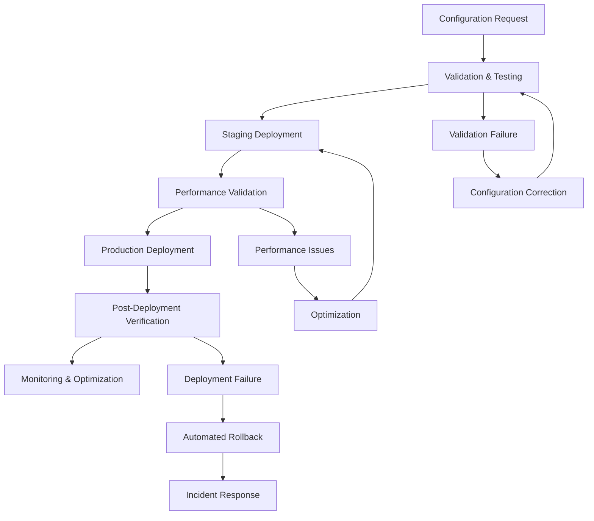

# Check Point Configuration Implementation Workflows

```yaml
---
state: permanent
type: implementation-workflow
created: 2025-06-19
last-reviewed: 2025-06-19
connections: 8
review-frequency: monthly
tags: [checkpoint, implementation-procedures, deployment-workflows, enterprise-automation, operational-excellence]
---
```

## Overview

Comprehensive implementation workflows and deployment procedures for Check Point configuration management, providing systematic approaches to configuration deployment, validation, and optimization across enterprise infrastructure.

## Workflow Architecture Framework

### Configuration Deployment Pipeline


## Core Implementation Workflows

### Workflow 1: Routemap Configuration Deployment

#### Phase 1: Pre-Deployment Validation
```bash
#!/bin/bash
# Routemap Configuration Deployment Workflow

validate_routemap_configuration() {
    local config_file=$1
    local validation_results=""
    
    echo "=== Routemap Configuration Validation ==="
    
    # Syntax validation
    echo "1. Performing syntax validation..."
    syntax_check=$(gaia_config_validator --syntax --file "$config_file")
    if [ $? -ne 0 ]; then
        validation_results="${validation_results}SYNTAX_ERROR: $syntax_check\n"
    fi
    
    # Logic validation
    echo "2. Performing logic validation..."
    logic_check=$(routemap_logic_analyzer --file "$config_file")
    if [ $? -ne 0 ]; then
        validation_results="${validation_results}LOGIC_ERROR: $logic_check\n"
    fi
    
    # Best practice validation
    echo "3. Performing best practice validation..."
    bp_check=$(routemap_best_practice_checker --file "$config_file")
    if [ $? -ne 0 ]; then
        validation_results="${validation_results}BEST_PRACTICE_WARNING: $bp_check\n"
    fi
    
    # Conflict detection
    echo "4. Checking for configuration conflicts..."
    conflict_check=$(routemap_conflict_detector --file "$config_file" --existing-config)
    if [ $? -ne 0 ]; then
        validation_results="${validation_results}CONFLICT_ERROR: $conflict_check\n"
    fi
    
    if [ -z "$validation_results" ]; then
        echo "✅ Configuration validation passed"
        return 0
    else
        echo "❌ Configuration validation failed:"
        echo -e "$validation_results"
        return 1
    fi
}
```

#### Phase 2: Staging Deployment
```bash
deploy_routemap_staging() {
    local config_file=$1
    local staging_gateways=$2
    
    echo "=== Staging Deployment ==="
    
    # Create staging backup
    echo "1. Creating staging backup..."
    staging_backup_id=$(create_configuration_backup --environment staging --timestamp)
    
    # Deploy to staging environment
    echo "2. Deploying to staging environment..."
    for gateway in $staging_gateways; do
        echo "   Deploying to gateway: $gateway"
        
        deployment_result=$(gaia_api_client \
            --gateway "$gateway" \
            --action deploy_routemap \
            --config-file "$config_file" \
            --backup-id "$staging_backup_id")
        
        if [ $? -ne 0 ]; then
            echo "❌ Staging deployment failed for gateway: $gateway"
            echo "   Error: $deployment_result"
            
            # Automatic rollback
            echo "   Initiating automatic rollback..."
            rollback_configuration --gateway "$gateway" --backup-id "$staging_backup_id"
            return 1
        fi
        
        echo "✅ Staging deployment successful for gateway: $gateway"
    done
    
    # Validate staging deployment
    echo "3. Validating staging deployment..."
    validate_routemap_functionality --environment staging --config-file "$config_file"
    
    return $?
}
```

#### Phase 3: Production Deployment
```bash
deploy_routemap_production() {
    local config_file=$1
    local production_gateways=$2
    
    echo "=== Production Deployment ==="
    
    # Create production backup
    echo "1. Creating production backup..."
    production_backup_id=$(create_configuration_backup --environment production --timestamp)
    
    # Maintenance window validation
    echo "2. Validating maintenance window..."
    if ! validate_maintenance_window; then
        echo "❌ Outside approved maintenance window"
        return 1
    fi
    
    # Gradual rollout strategy
    echo "3. Initiating gradual rollout..."
    for gateway in $production_gateways; do
        echo "   Deploying to production gateway: $gateway"
        
        # Deploy configuration
        deployment_result=$(gaia_api_client \
            --gateway "$gateway" \
            --action deploy_routemap \
            --config-file "$config_file" \
            --backup-id "$production_backup_id" \
            --validation-mode strict)
        
        if [ $? -ne 0 ]; then
            echo "❌ Production deployment failed for gateway: $gateway"
            
            # Emergency rollback
            echo "   Initiating emergency rollback..."
            emergency_rollback --gateway "$gateway" --backup-id "$production_backup_id"
            
            # Alert operations team
            send_alert --severity critical --message "Routemap deployment failed: $gateway"
            return 1
        fi
        
        # Validate individual gateway
        echo "   Validating gateway: $gateway"
        if ! validate_gateway_health --gateway "$gateway" --timeout 300; then
            echo "❌ Gateway health validation failed: $gateway"
            
            # Rollback and alert
            rollback_configuration --gateway "$gateway" --backup-id "$production_backup_id"
            send_alert --severity critical --message "Gateway health check failed: $gateway"
            return 1
        fi
        
        echo "✅ Production deployment successful for gateway: $gateway"
        
        # Brief pause between gateways for stability
        sleep 30
    done
    
    # Final validation
    echo "4. Performing final validation..."
    validate_complete_deployment --environment production --config-file "$config_file"
    
    return $?
}
```

### Workflow 2: SAM Rules Emergency Response

#### Phase 1: Threat Detection and Response
```bash
emergency_sam_rule_deployment() {
    local threat_indicators=$1
    local response_level=$2
    
    echo "=== Emergency SAM Rule Deployment ==="
    
    # Validate threat indicators
    echo "1. Validating threat indicators..."
    if ! validate_threat_indicators "$threat_indicators"; then
        echo "❌ Invalid threat indicators"
        return 1
    fi
    
    # Determine response scope
    echo "2. Determining response scope..."
    case $response_level in
        "critical")
            target_gateways=$(get_all_production_gateways)
            expiration_hours=1
            ;;
        "high")
            target_gateways=$(get_perimeter_gateways)
            expiration_hours=4
            ;;
        "medium")
            target_gateways=$(get_specified_gateways "$threat_indicators")
            expiration_hours=24
            ;;
        *)
            echo "❌ Invalid response level: $response_level"
            return 1
            ;;
    esac
    
    # Create SAM rules
    echo "3. Creating emergency SAM rules..."
    sam_rule_id=$(create_sam_rule \
        --threat-indicators "$threat_indicators" \
        --action block \
        --expiration-hours "$expiration_hours" \
        --reason "Automated threat response - Level: $response_level")
    
    if [ $? -ne 0 ]; then
        echo "❌ SAM rule creation failed"
        return 1
    fi
    
    # Deploy to target gateways
    echo "4. Deploying SAM rules to target gateways..."
    for gateway in $target_gateways; do
        echo "   Deploying to gateway: $gateway"
        
        deployment_result=$(deploy_sam_rule \
            --gateway "$gateway" \
            --rule-id "$sam_rule_id" \
            --priority emergency)
        
        if [ $? -ne 0 ]; then
            echo "❌ SAM rule deployment failed for gateway: $gateway"
            echo "   Error: $deployment_result"
            
            # Continue with other gateways but log failure
            log_deployment_failure --gateway "$gateway" --rule-id "$sam_rule_id"
        else
            echo "✅ SAM rule deployed successfully to gateway: $gateway"
        fi
    done
    
    # Monitor effectiveness
    echo "5. Initiating effectiveness monitoring..."
    monitor_sam_rule_effectiveness --rule-id "$sam_rule_id" --duration "$expiration_hours"
    
    # Notification
    send_notification --type sam_rule_deployed \
        --rule-id "$sam_rule_id" \
        --threat-indicators "$threat_indicators" \
        --response-level "$response_level"
    
    return 0
}
```

#### Phase 2: SAM Rule Lifecycle Management
```bash
manage_sam_rule_lifecycle() {
    local rule_id=$1
    
    echo "=== SAM Rule Lifecycle Management ==="
    
    # Monitor rule effectiveness
    echo "1. Monitoring rule effectiveness..."
    effectiveness_metrics=$(get_sam_rule_metrics --rule-id "$rule_id")
    
    blocked_connections=$(echo "$effectiveness_metrics" | grep "blocked_connections" | awk '{print $2}')
    false_positives=$(echo "$effectiveness_metrics" | grep "false_positives" | awk '{print $2}')
    
    # Evaluate rule performance
    echo "2. Evaluating rule performance..."
    if [ "$blocked_connections" -gt 0 ] && [ "$false_positives" -lt 5 ]; then
        echo "✅ SAM rule performing effectively"
        rule_status="effective"
    elif [ "$false_positives" -gt 10 ]; then
        echo "⚠️  High false positive rate detected"
        rule_status="tuning_required"
    else
        echo "ℹ️  Low activity detected"
        rule_status="monitoring"
    fi
    
    # Take appropriate action based on performance
    case $rule_status in
        "effective")
            echo "3. Rule performing well - continuing monitoring"
            ;;
        "tuning_required")
            echo "3. Tuning rule to reduce false positives..."
            tune_sam_rule --rule-id "$rule_id" --reduce-false-positives
            ;;
        "monitoring")
            echo "3. Continuing monitoring with potential early expiration"
            ;;
    esac
    
    # Check for expiration
    expiration_time=$(get_sam_rule_expiration --rule-id "$rule_id")
    current_time=$(date +%s)
    
    if [ "$current_time" -ge "$expiration_time" ]; then
        echo "4. Rule expired - initiating cleanup..."
        cleanup_expired_sam_rule --rule-id "$rule_id"
    fi
    
    return 0
}
```

### Workflow 3: Performance Optimization Deployment

#### Phase 1: Hardware Assessment and Optimization
```bash
deploy_performance_optimization() {
    local gateway_id=$1
    local optimization_profile=$2
    
    echo "=== Performance Optimization Deployment ==="
    
    # Hardware capability assessment
    echo "1. Assessing hardware capabilities..."
    hardware_assessment=$(assess_gateway_hardware --gateway "$gateway_id")
    
    aes_ni_support=$(echo "$hardware_assessment" | grep "aes_ni" | awk '{print $2}')
    cpu_cores=$(echo "$hardware_assessment" | grep "cpu_cores" | awk '{print $2}')
    memory_gb=$(echo "$hardware_assessment" | grep "memory_gb" | awk '{print $2}')
    network_interfaces=$(echo "$hardware_assessment" | grep "network_interfaces" | awk '{print $2}')
    
    echo "   AES-NI Support: $aes_ni_support"
    echo "   CPU Cores: $cpu_cores"
    echo "   Memory: ${memory_gb}GB"
    echo "   Network Interfaces: $network_interfaces"
    
    # Generate optimization configuration
    echo "2. Generating optimization configuration..."
    optimization_config=$(generate_optimization_config \
        --gateway "$gateway_id" \
        --profile "$optimization_profile" \
        --aes-ni "$aes_ni_support" \
        --cpu-cores "$cpu_cores" \
        --memory "$memory_gb" \
        --interfaces "$network_interfaces")
    
    # Validate optimization configuration
    echo "3. Validating optimization configuration..."
    if ! validate_optimization_config --config "$optimization_config" --gateway "$gateway_id"; then
        echo "❌ Optimization configuration validation failed"
        return 1
    fi
    
    # Create performance baseline
    echo "4. Creating performance baseline..."
    baseline_metrics=$(capture_performance_baseline --gateway "$gateway_id" --duration 300)
    
    # Deploy optimization configuration
    echo "5. Deploying optimization configuration..."
    deployment_result=$(deploy_optimization_config \
        --gateway "$gateway_id" \
        --config "$optimization_config" \
        --baseline "$baseline_metrics")
    
    if [ $? -ne 0 ]; then
        echo "❌ Optimization deployment failed"
        echo "   Error: $deployment_result"
        return 1
    fi
    
    # Monitor performance improvement
    echo "6. Monitoring performance improvement..."
    monitor_performance_optimization \
        --gateway "$gateway_id" \
        --baseline "$baseline_metrics" \
        --duration 1800
    
    return $?
}
```

#### Phase 2: SecureXL Configuration Optimization
```bash
optimize_securexl_configuration() {
    local gateway_id=$1
    
    echo "=== SecureXL Configuration Optimization ==="
    
    # Current SecureXL status assessment
    echo "1. Assessing current SecureXL status..."
    securexl_status=$(get_securexl_status --gateway "$gateway_id")
    
    if ! echo "$securexl_status" | grep -q "enabled"; then
        echo "⚠️  SecureXL not enabled - enabling SecureXL..."
        enable_securexl --gateway "$gateway_id"
    fi
    
    # CPU affinity optimization
    echo "2. Optimizing CPU affinity..."
    current_affinity=$(get_cpu_affinity --gateway "$gateway_id")
    optimal_affinity=$(calculate_optimal_affinity \
        --gateway "$gateway_id" \
        --current "$current_affinity")
    
    if [ "$current_affinity" != "$optimal_affinity" ]; then
        echo "   Updating CPU affinity: $current_affinity -> $optimal_affinity"
        set_cpu_affinity --gateway "$gateway_id" --affinity "$optimal_affinity"
    else
        echo "   CPU affinity already optimal: $current_affinity"
    fi
    
    # NAT optimization
    echo "3. Optimizing NAT configuration..."
    nat_optimization=$(determine_nat_optimization --gateway "$gateway_id")
    
    case $nat_optimization in
        "templates")
            echo "   Enabling NAT templates..."
            enable_nat_templates --gateway "$gateway_id"
            ;;
        "timeout_reduction")
            echo "   Reducing TCP timeout..."
            set_tcp_timeout --gateway "$gateway_id" --timeout 2
            ;;
        "hash_table_expansion")
            echo "   Expanding connection hash table..."
            set_connection_hash_size --gateway "$gateway_id" --size 8388608
            ;;
    esac
    
    # Acceleration features
    echo "4. Enabling advanced acceleration features..."
    enable_accelerated_drops --gateway "$gateway_id"
    enable_optimized_drops --gateway "$gateway_id"
    configure_delayed_sync --gateway "$gateway_id"
    
    # Validation and monitoring
    echo "5. Validating SecureXL optimization..."
    validate_securexl_optimization --gateway "$gateway_id"
    
    return $?
}
```

### Workflow 4: Comprehensive Backup Strategy Implementation

#### Phase 1: Backup Strategy Deployment
```bash
implement_comprehensive_backup_strategy() {
    local gateway_id=$1
    local backup_profile=$2
    
    echo "=== Comprehensive Backup Strategy Implementation ==="
    
    # Backup requirements assessment
    echo "1. Assessing backup requirements..."
    backup_requirements=$(assess_backup_requirements \
        --gateway "$gateway_id" \
        --profile "$backup_profile")
    
    change_frequency=$(echo "$backup_requirements" | grep "change_frequency" | awk '{print $2}')
    criticality_level=$(echo "$backup_requirements" | grep "criticality" | awk '{print $2}')
    compliance_requirements=$(echo "$backup_requirements" | grep "compliance" | awk '{print $2}')
    
    # Create backup schedule
    echo "2. Creating backup schedule..."
    case $change_frequency in
        "high")
            snapshot_frequency="before_each_change"
            system_backup_frequency="daily"
            config_save_frequency="on_demand"
            ;;
        "medium")
            snapshot_frequency="weekly"
            system_backup_frequency="weekly"
            config_save_frequency="daily"
            ;;
        "low")
            snapshot_frequency="monthly"
            system_backup_frequency="monthly"
            config_save_frequency="weekly"
            ;;
    esac
    
    # Implement backup scheduling
    echo "3. Implementing backup scheduling..."
    
    # Snapshot scheduling
    schedule_snapshots \
        --gateway "$gateway_id" \
        --frequency "$snapshot_frequency" \
        --retention 30 \
        --triggers "before_upgrade,before_hotfix"
    
    # System backup scheduling
    schedule_system_backups \
        --gateway "$gateway_id" \
        --frequency "$system_backup_frequency" \
        --retention 90 \
        --compression enabled
    
    # Configuration save scheduling
    schedule_config_saves \
        --gateway "$gateway_id" \
        --frequency "$config_save_frequency" \
        --retention 365 \
        --version-control enabled
    
    # Backup validation scheduling
    echo "4. Implementing backup validation..."
    schedule_backup_validation \
        --gateway "$gateway_id" \
        --test-frequency monthly \
        --restore-test quarterly
    
    # Monitoring and alerting
    echo "5. Setting up backup monitoring..."
    configure_backup_monitoring \
        --gateway "$gateway_id" \
        --alert-on-failure true \
        --performance-monitoring true \
        --success-notification true
    
    return $?
}
```

#### Phase 2: Backup Validation and Testing
```bash
validate_backup_strategy() {
    local gateway_id=$1
    
    echo "=== Backup Strategy Validation ==="
    
    # Test snapshot creation
    echo "1. Testing snapshot creation..."
    test_snapshot_id=$(create_test_snapshot --gateway "$gateway_id" --test-mode)
    
    if [ $? -ne 0 ]; then
        echo "❌ Snapshot creation test failed"
        return 1
    fi
    
    echo "✅ Snapshot creation test successful: $test_snapshot_id"
    
    # Test system backup
    echo "2. Testing system backup..."
    test_backup_id=$(create_test_system_backup --gateway "$gateway_id" --test-mode)
    
    if [ $? -ne 0 ]; then
        echo "❌ System backup test failed"
        return 1
    fi
    
    echo "✅ System backup test successful: $test_backup_id"
    
    # Test configuration save
    echo "3. Testing configuration save..."
    test_config_file=$(create_test_config_save --gateway "$gateway_id" --test-mode)
    
    if [ $? -ne 0 ]; then
        echo "❌ Configuration save test failed"
        return 1
    fi
    
    echo "✅ Configuration save test successful: $test_config_file"
    
    # Test restoration procedures
    echo "4. Testing restoration procedures..."
    if ! test_restoration_procedures --gateway "$gateway_id" --test-environment; then
        echo "❌ Restoration procedure test failed"
        return 1
    fi
    
    echo "✅ Restoration procedure test successful"
    
    # Cleanup test artifacts
    echo "5. Cleaning up test artifacts..."
    cleanup_test_backups --snapshot "$test_snapshot_id" --backup "$test_backup_id" --config "$test_config_file"
    
    return 0
}
```

## Quality Assurance and Validation Framework

### Pre-Deployment Validation Checklist
```bash
pre_deployment_validation() {
    local config_file=$1
    local deployment_type=$2
    
    echo "=== Pre-Deployment Validation Checklist ==="
    
    validation_passed=true
    
    # Configuration syntax validation
    echo "☐ Configuration syntax validation..."
    if ! validate_configuration_syntax --file "$config_file"; then
        echo "❌ Syntax validation failed"
        validation_passed=false
    else
        echo "✅ Syntax validation passed"
    fi
    
    # Logic validation
    echo "☐ Configuration logic validation..."
    if ! validate_configuration_logic --file "$config_file"; then
        echo "❌ Logic validation failed"
        validation_passed=false
    else
        echo "✅ Logic validation passed"
    fi
    
    # Security validation
    echo "☐ Security policy validation..."
    if ! validate_security_compliance --file "$config_file"; then
        echo "❌ Security validation failed"
        validation_passed=false
    else
        echo "✅ Security validation passed"
    fi
    
    # Performance impact assessment
    echo "☐ Performance impact assessment..."
    if ! assess_performance_impact --file "$config_file"; then
        echo "❌ Performance assessment failed"
        validation_passed=false
    else
        echo "✅ Performance assessment passed"
    fi
    
    # Rollback procedure verification
    echo "☐ Rollback procedure verification..."
    if ! verify_rollback_procedures --deployment-type "$deployment_type"; then
        echo "❌ Rollback verification failed"
        validation_passed=false
    else
        echo "✅ Rollback verification passed"
    fi
    
    # Maintenance window validation
    echo "☐ Maintenance window validation..."
    if ! validate_maintenance_window --deployment-type "$deployment_type"; then
        echo "❌ Maintenance window validation failed"
        validation_passed=false
    else
        echo "✅ Maintenance window validation passed"
    fi
    
    if [ "$validation_passed" = true ]; then
        echo "✅ All pre-deployment validations passed"
        return 0
    else
        echo "❌ Pre-deployment validation failed"
        return 1
    fi
}
```

### Post-Deployment Verification
```bash
post_deployment_verification() {
    local gateway_id=$1
    local config_file=$2
    
    echo "=== Post-Deployment Verification ==="
    
    verification_passed=true
    
    # Configuration deployment verification
    echo "☐ Configuration deployment verification..."
    if ! verify_configuration_deployed --gateway "$gateway_id" --config "$config_file"; then
        echo "❌ Configuration deployment verification failed"
        verification_passed=false
    else
        echo "✅ Configuration deployment verified"
    fi
    
    # Functionality testing
    echo "☐ Functionality testing..."
    if ! test_gateway_functionality --gateway "$gateway_id"; then
        echo "❌ Functionality testing failed"
        verification_passed=false
    else
        echo "✅ Functionality testing passed"
    fi
    
    # Performance validation
    echo "☐ Performance validation..."
    if ! validate_gateway_performance --gateway "$gateway_id"; then
        echo "❌ Performance validation failed"
        verification_passed=false
    else
        echo "✅ Performance validation passed"
    fi
    
    # Security posture verification
    echo "☐ Security posture verification..."
    if ! verify_security_posture --gateway "$gateway_id"; then
        echo "❌ Security posture verification failed"
        verification_passed=false
    else
        echo "✅ Security posture verified"
    fi
    
    # Monitoring activation
    echo "☐ Monitoring activation..."
    if ! activate_enhanced_monitoring --gateway "$gateway_id"; then
        echo "❌ Monitoring activation failed"
        verification_passed=false
    else
        echo "✅ Enhanced monitoring activated"
    fi
    
    if [ "$verification_passed" = true ]; then
        echo "✅ All post-deployment verifications passed"
        return 0
    else
        echo "❌ Post-deployment verification failed"
        return 1
    fi
}
```

## Monitoring and Continuous Improvement

### Continuous Monitoring Framework
```bash
continuous_monitoring() {
    local gateway_id=$1
    
    echo "=== Continuous Monitoring Framework ==="
    
    # Performance monitoring
    echo "1. Initiating performance monitoring..."
    start_performance_monitoring --gateway "$gateway_id" --interval 300 --metrics comprehensive
    
    # Configuration drift detection
    echo "2. Starting configuration drift detection..."
    start_drift_monitoring --gateway "$gateway_id" --baseline-config --alert-threshold medium
    
    # Security posture monitoring
    echo "3. Activating security posture monitoring..."
    start_security_monitoring --gateway "$gateway_id" --compliance-checks enabled
    
    # Backup health monitoring
    echo "4. Enabling backup health monitoring..."
    start_backup_monitoring --gateway "$gateway_id" --validation-frequency daily
    
    # Automated optimization suggestions
    echo "5. Activating optimization suggestions..."
    start_optimization_advisor --gateway "$gateway_id" --analysis-frequency weekly
    
    return 0
}
```

## Implementation Success Metrics

### Key Performance Indicators
- **Deployment Success Rate**: Target 99.9% successful deployments
- **Rollback Frequency**: Target <1% of deployments requiring rollback
- **Configuration Validation Accuracy**: Target 100% error detection before deployment
- **Performance Improvement**: Target 15-25% performance improvement through optimization
- **Backup Success Rate**: Target 100% backup success with <5% restoration test failures
- **Mean Time to Deploy**: Target <30 minutes for routine configuration changes
- **Mean Time to Recovery**: Target <15 minutes for emergency rollback procedures

### Continuous Improvement Framework
- **Weekly Performance Reviews**: Analyze deployment metrics and optimization opportunities
- **Monthly Process Optimization**: Review and refine implementation workflows
- **Quarterly Strategy Assessment**: Evaluate automation strategy and technology adoption
- **Annual Framework Evolution**: Major framework updates and capability enhancements

---

*These implementation workflows provide comprehensive, systematic approaches to Check Point configuration management with emphasis on validation, automation, monitoring, and continuous improvement for enterprise-scale deployments.*